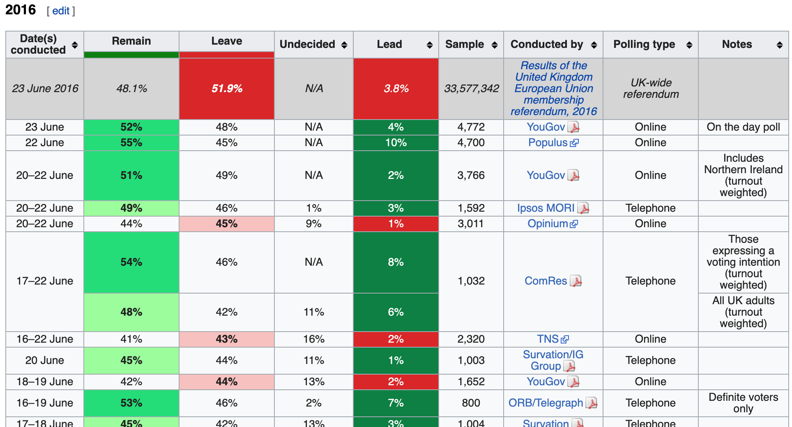

```{r setup, include=FALSE}
knitr::opts_chunk$set(echo = TRUE)
```
# Section 1: Data Import
## Data Import Overview
In the **Data Import** section, you will learn how import data into R.

After completing this section, you will be able to:  

- **Import** data from spreadsheets.
- Identify and set your **working directory** and specify the path to a file.
- Use the **`readr`** and **`readxl`** packages to import spreadsheets.
- Use **R-base functions** to import spreadsheets.
- **Download** files from the internet using R.

There is a comprehension check at the end of the section.

We encourage you to use R to interactively test out your answers and further your own learning. If you get stuck, we encourage you to search the discussion boards for the answer to your issue or ask us for help!


## 1.1: Data Import
### Importing Spreadsheets
**Textbook link**  
This video corresponds to the [textbook chapter introduction to importing data.](https://rafalab.github.io/dsbook/importing-data.html)

**Key points**

- Many datasets are stored in spreadsheets. A spreadsheet is essentially a file version of a data frame with rows and columns.
- Spreadsheets have rows separated by returns and columns separated by a delimiter. The most common delimiters are comma, semicolon, white space and tab.
- Many spreadsheets are raw text files and can be read with any basic text editor. However, some formats are proprietary and cannot be read with a text editor, such as Microsoft Excel files (.xls).
- Most import functions assume that the first row of a spreadsheet file is a header with column names. To know if the file has a header, it helps to look at the file with a text editor before trying to import it.

### Paths and the Working Directory
**Textbook link**  
This video corresponds to the [textbook section on paths and the working directory.](https://rafalab.github.io/dsbook/importing-data.html#paths-and-the-working-directory)

**Key points**

- The working directory is where R looks for files and saves files by default.
- See your working directory with `getwd`. Change your working directory with `setwd`.
- We suggest you create a directory for each project and keep your raw data inside that directory.
- Use the `file.path` function to generate a full path from a relative path and a file name. Use `file.path` instead of `paste` because `file.path` is aware of your operating system and will use the correct slashes to navigate your machine.
- The `file.copy` function copies a file to a new path.

**Code**
```{r}
# see working directory
dir <- getwd()
dir

# change your working directory
setwd(dir)

# set path to the location for raw data files in the dslabs package and list files
path <- system.file("extdata", package="dslabs")
list.files(path)

# generate a full path to a file
filename <- "murders.csv"
fullpath <- file.path(path, filename)
fullpath

# copy file from dslabs package to your working directory
file.copy(fullpath, getwd())

# check if the file exists
file.exists(filename)
```

A lot more information about this topic is available in [Data Science: Productivity Tools.](https://www.edx.org/course/data-science-productivity-tools-harvardx-ph125-5x)


### The readr and readxl Packages
**Textbook link**  
This video corresponds to the [textbook section on the readr and readxl packages.](https://rafalab.github.io/dsbook/importing-data.html#the-readr-and-readxl-packages)

**Key points**

- **`readr`** is the `tidyverse` library that includes functions for reading data stored in text file spreadsheets into R. Functions in the package include `read_csv`, `read_tsv`, `read_delim` and more. These differ by the delimiter they use to split columns.
- The **`readxl`** package provides functions to read Microsoft Excel formatted files.
- The `excel_sheets` function gives the names of the sheets in the Excel file. These names are passed to the sheet argument for the `readxl` functions `read_excel`, `read_xls` and `read_xlsx`.
- The `read_lines` function shows the first few lines of a file in R.

**Code**
```{r}
library(dslabs)
library(tidyverse)    # includes readr
library(readxl)

# inspect the first 3 lines
read_lines("murders.csv", n_max = 3)
# read file in CSV format
dat <- read_csv(filename)

#read using full path
dat <- read_csv(fullpath)
head(dat)

#Ex：
path <- system.file("extdata", package = "dslabs")
files <- list.files(path)
files
filename <- "murders.csv"
filename1 <- "life-expectancy-and-fertility-two-countries-example.csv"
filename2 <- "fertility-two-countries-example.csv"
dat=read.csv(file.path(path, filename))
dat1=read.csv(file.path(path, filename1))
dat2=read.csv(file.path(path, filename2))
```
### Importing Data Using R-base Functions
**Textbook link**  
This video corresponds to the [textbook section on R-base importing functions.](https://rafalab.github.io/dsbook/importing-data.html#r-base-importing-functions)

**Key point**

- R-base import functions (`read.csv`, `read.table`, `read.delim`) generate data frames rather than tibbles and character variables are converted to factors. This can be avoided by setting the argument `stringsAsFactors=FALSE`.

**Code**
```{r}
# filename is defined in the previous video
# read.csv converts strings to factors
dat2 <- read.csv(filename)
class(dat2$abb)
class(dat2$region)
```

### Downloading Files from the Internet
**Textbook link**  
This video corresponds to the [textbook section on downloading files.](https://rafalab.github.io/dsbook/importing-data.html#downloading-files)

**Key points**

- The `read_csv` function and other import functions can read a URL directly.
- If you want to have a local copy of the file, you can use `download.file`.
- `tempdir` creates a directory with a name that is very unlikely not to be unique.
- `tempfile` creates a character string that is likely to be a unique filename.

**Code**  
```{r}
url <- "https://raw.githubusercontent.com/rafalab/dslabs/master/inst/extdata/murders.csv"
dat <- read_csv(url)
download.file(url, "murders.csv")

tempfile()
tmp_filename <- tempfile()
download.file(url, tmp_filename)

dat <- read_csv(tmp_filename)
file.remove(tmp_filename)
```

### Assessment Part 1: Data Import
In this part of the assessment, you will answer several multiple choice questions that review the concepts of data import. You can answer these questions without using R, although you may find it helpful to experiment with commands in your console.

In the second part of the assessment on the next page, you will import real datasets and learn more about useful arguments to `readr` functions. The second part of the assessment will require you to program in R.

#### Question 1
Which of the following is NOT part of the data wrangling process?

- Importing data into R
- Formatting dates/times
- **Checking correlations between your variables**
- Tidying data

**Answer**  
Data analyses, such as checking correlations or creating visualizations, are done AFTER the data has been processed into a tidy format.

#### Question 2
Which files could be opened in a basic text editor?  
Select ALL that apply.

- **data.txt**
- **data.csv**
- data.xlsx
- **data.tsv**

**Explanation**  
.txt, .csv, and .tsv files can all be opened by any basic text editor. Microsoft Excel files (.xlsx) use a proprietary format that can't be viewed with a basic text editor.

#### Question 3
You want to analyze a file containing race finish times for a recent marathon. You open the file in a basic text editor and see lines that look like the following:

```
initials,state,age,time
vib,MA,61,6:01
adc,TX,45,5:45
kme,CT,50,4:19
```

What type of file is this?

- A comma-delimited file without a header
- A tab-delimited file with a header
- A white space-delimited file without a header
- **A comma-delimited file with a header**

**Answer**  
This file has a header that describes the contents of each column. Values are separated by commas.

#### Question 4
Assume the following is the full path to the directory that a student wants to use as their working directory in R: `"/Users/student/Documents/projects/"`

Which of the following lines of code CANNOT set the working directory to the desired "projects" directory?

- `setwd("~/Documents/projects/")`
- `setwd("/Users/student/Documents/projects/")`
- **`setwd(/Users/student/Documents/projects/)`**
- `dir <- "/Users/student/Documents/projects"`
`setwd(dir)`

**Answer**  
You need to use quotation marks when providing a full path to the working directory.

#### Question 5
We want to copy the "murders.csv" file from the dslabs package into an existing folder "data", which is located in our HarvardX-Wrangling projects folder. We first enter the code below into our RStudio console.

```
> getwd()
[1] "C:/Users/UNIVERSITY/Documents/Analyses/HarvardX-Wrangling"
> filename <- "murders.csv"
> path <- system.file("extdata", package = "dslabs")
```
Which of the following commands would NOT successfully copy “murders.csv” into the folder “data”?

- **`file.copy(file.path(path, "murders.csv"), getwd())`**
 
- `setwd("data")`
`file.copy(file.path(path, filename), getwd())`
- `file.copy(file.path(path, "murders.csv"), file.path(getwd(), "data"))`
- ```file.location <- file.path(system.file("extdata", package = "dslabs"), "murders.csv")
file.destination <- file.path(getwd(), "data")
file.copy(file.location, file.destination)```

**Answer**  
This command does NOT copy the “murders.csv” file into your “data” folder; instead it copies it into the parent directory, “HarvardX-Wrangling”. You need to specify the “data” folder, either by changing the working directory or by adding it to the file path.

#### Question 6
You are not sure whether the murders.csv file has a header row. How could you check this?

- **Open the file in a basic text editor.**
- **In the RStudio “Files” pane, click on your file, then select “View File”.**
- **Use the command `read_lines` (remembering to specify the number of rows with the n_max argument).**

#### Question 7
What is one difference between `read_excel` and `read_xlsx`?

- `read_excel` also reads meta-data from the excel file, such as sheet names, while `read_xlsx` only reads the first sheet in a file.
- **`read_excel` reads both .xls and .xlsx files by detecting the file format from its extension, while `read_xlsx` only reads .xlsx files.**
- `read_excel` is part of the readr package, while `read_xlsx` is part of the readxl package and has more options.
- `read_xlsx` has been replaced by `read_excel` in a recent readxl package update.

**Answer**  
You can use `read_excel` for both .xls and .xlsx files, while `read_xlsx` only reads .xlsx files.

#### Question 8
You have a file called “times.txt” that contains race finish times for a marathon. The first four lines of the file look like this:

```
initials,state,age,time
vib,MA,61,6:01
adc,TX,45,5:45
kme,CT,50,4:19
```
Which line of code will NOT produce a tibble with column names “initials”, “state”, “age”, and “time”?

- `race_times <- read_csv("times.txt")`
- **`race_times <- read.csv("times.txt")`**
- `race_times <- read_csv("times.txt", col_names = TRUE)`
- `race_times <- read_delim("times.txt", delim = “,”)`

**Answer**  
This code will import the comma-separated values table called “times.txt”, but the base R function `read.csv` does not produce a tibble. It creates a data frame.

#### Question 9
You also have access to marathon finish times in the form of an Excel document named “times.xlsx”. In the Excel document, different sheets contain race information for different years. The first sheet is named “2015”, the second is named “2016”, and the third is named “2017”.

Which line of code will NOT import the data contained in the “2016” tab of this Excel sheet?

- `times_2016 <- read_excel("times.xlsx", sheet = 2)`
- **`times_2016 <- read_xlsx("times.xlsx", sheet = “2”)`**
- `times_2016 <- read_excel("times.xlsx", sheet = "2016")`
- `times_2016 <- read_xlsx("times.xlsx", sheet = 2)`

**Answer**  
When the sheet argument is contained within quotes, the function expects a sheet name. There is no sheet named “2” in this spreadsheet, so the code will not work.

#### Question 10
You have a comma-separated values file that contains the initials, home states, ages, and race finish times for marathon runners. The runners’ initials contain three characters for the runners’ first, middle, and last names (for example, “KME”).

You read in the file using the following code.

```
race_times <- read.csv(“times.csv”)
```
What is the data type of the initials in the object race_times?

- integers
- characters
- **factors**
- logical

**Answer**  
If you don’t supply the argument `stringsAsFactors = F`, the `read.csv` function will automatically convert characters to factors.

#### Question 11
1/1 point (graded)
Which of the following is NOT a real difference between the readr import functions and the base R import functions?

- The import functions in the readr package all start as `read_`, while the import functions for base R all start with `read`.
- Base R import functions automatically convert character columns to factors.
- **The base R import functions can read .csv files, but cannot read files with other delimiters, such as .tsv files, or fixed-width files.**
- Base R functions import data as a data frame, while readr functions import data as a tibble.
correta
**Answer**  
This statement is false. The base R import functions can read files with other delimiters like .tsv using `read.delim` and can read fixed-width files using `read.fwf`.

#### Question 12
You read in a file containing runner information and marathon finish times using the following code.

```
race_times <- read.csv(“times.csv”, stringsAsFactors = F)
```
What is the class of the object `race_times`?

- data frame
- tibble
- matrix
- vector

**Answer**  
The `read.csv` function generates a data frame containing these data.

#### Question 13
Select the answer choice that summarizes all of the actions that the following lines of code can perform. Please note that the url below is an example and does not lead to data.

```
url <- "https://raw.githubusercontent.com/MyUserName/MyProject/master/MyData.csv "
dat <- read_csv(url)
download.file(url, "MyData.csv")
```
- Create a tibble in R called `dat` that contains the information contained in the csv file stored on Github and save that tibble to the working directory.
- Create a matrix in R called `dat` that contains the information contained in the csv file stored on Github. Download the csv file to the working directory and name the downloaded file “MyData.csv”.
- Create a tibble in R called `dat` that contains the information contained in the csv file stored on Github. Download the csv file to the working directory and randomly assign it a temporary name that is very likely to be unique.
- **Create a tibble in R called `dat` that contains the information contained in the csv file stored on Github. Download the csv file to the working directory and name the downloaded file “MyData.csv”.**

**Answer**  
The `read_csv` command creates the tibble in R and the `download.file` command downloads the csv file from the internet to the working directory with the specified name.

### Assessment Part 2: Data Import
In this part of the assessment, you will import real datasets and learn more about useful arguments to **`readr`** functions. You will encounter common issues that arise when importing raw data. This part of the assessment will require you to program in R.

Use the **`readr`** package in the **`tidyverse`** library:

```{r}
library(tidyverse)
```

#### Question 14
Inspect the file at the following URL:

[http://mlr.cs.umass.edu/ml/machine-learning-databases/breast-cancer-wisconsin/wdbc.data](http://mlr.cs.umass.edu/ml/machine-learning-databases/breast-cancer-wisconsin/wdbc.data)

Which **`readr`** function should be used to import this file?

- `read_table`
- **`read_csv`**
- `read_csv2`
- `read_tsv`
- None of the above

**Answer**  
this is a comma-separated value file.

#### Question 15
Check the documentation for the **`readr`** function you chose in the previous question to learn about its arguments. Determine which arguments you need to the file from the previous question:

```
url <- "http://mlr.cs.umass.edu/ml/machine-learning-databases/breast-cancer-wisconsin/wdbc.data"
```

Does this file have a header row? Does the **`readr`** function you chose need any additional arguments to import the data correctly?

- Yes, there is a header. No arguments are needed.
- Yes, there is a header. The `header=TRUE` argument is necessary.
- Yes, there is a header. The `col_names=TRUE` argument is necessary.
- No, there is no header. No arguments are needed.
- No, there is no header. The `header=FALSE` argument is necessary.
- **No, there is no header. The `col_names=FALSE` argument is necessary.**

**Answer**  
There are no variable names in the first row, and the correct argument to skip the header in **`readr`** is `col_names=FALSE`.

#### Question 16
Inspect the imported data from the previous question.

```{r}
library(readr)
url <- "https://archive.ics.uci.edu/ml/machine-learning-databases/breast-cancer-wisconsin/wdbc.data"
          df <- read_csv(url, col_names = FALSE)
```
How many rows are in the dataset?
```{r}
nrow(df)
```
How many columns are in the dataset?
```{r}
ncol(df)
```

#### Question 17
Read in the table from the following URL using a function from the `readr` library and save it as `co2_mauna_loa`:

```
url <- "ftp://aftp.cmdl.noaa.gov/products/trends/co2/co2_annmean_mlo.txt"
```

Use the skip argument to skip all of the documentation rows so that the column names are `c("year", "mean", "unc")` or `c("#", "year", "mean", "unc")`. (The "#" column could be removed after import with, for example, `select`.

How many rows must be skipped?
This may require some experimentation - this is normal for data wrangling.
```{r}
co2_mauna_loa <- read_table(url, skip = 56) # skip documentation
co2_mauna_loa
```

Which **`readr`** function correctly imports the table as a data frame after skipping the documentation rows?

- `read_csv`
- `read_csv2`
- `read_tsv`
- **`read_table`**
- `read_lines`

How many rows are in `co2_mauna_loa`?
```{r}
nrow(co2_mauna_loa)
```

# Section 2: Tidy Data
## Tidy Data Overview
In the **Tidy Data** section, you will learn how to convert data from a raw to a tidy format.

This section is divided into three parts: **Reshaping Data, Combining Tables**, and **Web Scraping.** There are comprehension checks at the end of each part.

After completing the **Tidy Data** section, you will be able to:

- **Reshape data** using functions from the `tidyr` package, including `gather`, `spread`, `separate`, and `unite`.
- Combine information from different tables using **join** functions from the dplyr package.
- Combine information from different tables using **binding** functions from the dplyr package.
- Use **set operators** to combine data frames.
- Gather data from a website through **web scraping** and use of **CSS selectors**.

We encourage you to use R to interactively test out your answers and further your own learning. If you get stuck, we encourage you to search the discussion boards for the answer to your issue or ask us for help!

## 2.1: Reshaping Data
### Tidy Data
**Textbook link**  
This video corresponds to the [textbook section on tidy data.](https://rafalab.github.io/dsbook/tidyverse.html#tidy-data)

**Key points**

- In tidy data, each row represents an observation and each column represents a different variable.
- In wide data, each row includes several observations and one of the variables is stored in the header.

**Code**
```{r}
library(tidyverse)
library(dslabs)
data(gapminder)

# create and inspect a tidy data frame
tidy_data <- gapminder %>% 
  filter(country %in% c("South Korea", "Germany")) %>%
  select(country, year, fertility)
head(tidy_data)

# plotting tidy data is simple
tidy_data %>% 
  ggplot(aes(year, fertility, color = country)) +
  geom_point()

# import and inspect example of original Gapminder data in wide format
path <- system.file("extdata", package="dslabs")
filename <- file.path(path,  "fertility-two-countries-example.csv")
wide_data <- read_csv(filename)
select(wide_data, country, `1960`:`1967`)
```

### Reshaping Data
**Textbook links**  
This video corresponds to the [textbook sections on reshaping data,](https://rafalab.github.io/dsbook/reshaping-data.html) the [gather function](https://rafalab.github.io/dsbook/reshaping-data.html#gather) and the [separate function.](https://rafalab.github.io/dsbook/reshaping-data.html#spread)

**Key points**

- The **`tidyr`** package includes several functions that are useful for tidying data.
- The `gather` function converts wide data into tidy data.
- The `spread` function converts tidy data to wide data.

**Code**
```{r}
# original wide data
library(tidyverse) 
path <- system.file("extdata", package="dslabs")
filename <- file.path(path,  "fertility-two-countries-example.csv")
wide_data <- read_csv(filename)

# tidy data from dslabs
library(dslabs)
data("gapminder")
tidy_data <- gapminder %>% 
  filter(country %in% c("South Korea", "Germany")) %>%
  select(country, year, fertility)

# gather wide data to make new tidy data
new_tidy_data <- wide_data %>%
  gather(year, fertility, `1960`:`2015`)
head(new_tidy_data)

# gather all columns except country
new_tidy_data <- wide_data %>%
  gather(year, fertility, -country)

# gather treats column names as characters by default
class(tidy_data$year)
class(new_tidy_data$year)

# convert gathered column names to numeric
new_tidy_data <- wide_data %>%
  gather(year, fertility, -country, convert = TRUE)
class(new_tidy_data$year)

# ggplot works on new tidy data
new_tidy_data %>%
  ggplot(aes(year, fertility, color = country)) +
  geom_point()

# spread tidy data to generate wide data
new_wide_data <- new_tidy_data %>% spread(year, fertility)
select(new_wide_data, country, `1960`:`1967`)
```

### Separate and Unite
**Textbook links**  
This video corresponds to the [textbook sections on the separate function](https://rafalab.github.io/dsbook/reshaping-data.html#separate) and [the unite function.](https://rafalab.github.io/dsbook/reshaping-data.html#unite)

**Key points**

- The `separate` function splits one column into two or more columns at a specified character that separates the variables.
- When there is an extra separation in some of the entries, use `fill="right"` to pad missing values with NAs, or use `extra="merge"` to keep extra elements together.
- The `unite` function combines two columns and adds a separating character.

**Code**
```{r}
# import data
path <- system.file("extdata", package = "dslabs")
filename <- file.path(path, "life-expectancy-and-fertility-two-countries-example.csv")
raw_dat <- read_csv(filename)
select(raw_dat, 1:5)

# gather all columns except country
dat <- raw_dat %>% gather(key, value, -country)
head(dat)
dat$key[1:5]

# separate on underscores
dat %>% separate(key, c("year", "variable_name"), "_")
dat %>% separate(key, c("year", "variable_name"))

# split on all underscores, pad empty cells with NA
dat %>% separate(key, c("year", "first_variable_name", "second_variable_name"), 
                 fill = "right")

# split on first underscore but keep life_expectancy merged
dat %>% separate(key, c("year", "variable_name"), sep = "_", extra = "merge")

# separate then spread
dat %>% separate(key, c("year", "variable_name"), sep = "_", extra = "merge") %>%
  spread(variable_name, value) 

# separate then unite
dat %>% 
  separate(key, c("year", "first_variable_name", "second_variable_name"), fill = "right") %>%
  unite(variable_name, first_variable_name, second_variable_name, sep="_")

# full code for tidying data
dat %>% 
  separate(key, c("year", "first_variable_name", "second_variable_name"), fill = "right") %>%
  unite(variable_name, first_variable_name, second_variable_name, sep="_") %>%
  spread(variable_name, value) %>%
  rename(fertility = fertility_NA)
```

### Assessment Part 1: Reshaping Data
Part 1 consists of 8 questions are conceptual questions about tidy data and reshaping data. They do not necessarily require R, but you may benefit from checking your work on the console.

Part 2 consists of 7 questions which require you to write code in R to apply the new concepts about tidy data and reshaping data.

#### Question 1
A collaborator sends you a file containing data for three years of average race finish times.

```
age_group,2015,2016,2017
20,3:46,3:22,3:50
30,3:50,3:43,4:43
40,4:39,3:49,4:51
50,4:48,4:59,5:01
```

Are these data considered “tidy” in R? Why or why not?

- Yes. These data are considered “tidy” because each row contains unique observations.
- Yes. These data are considered “tidy” because there are no missing data in the data frame.
- **No. These data are not considered “tidy” because the variable “year” is stored in the header.**
- No. These data are not considered “tidy” because there are not an equal number of columns and rows.

**Answer**  
The year is a variable and should be stored as a column instead of across multiple columns in the header.

#### Question 2
Below are four versions of the same dataset. Which one is in a tidy format?
There are two correct answers. Select either of them for full credit.

- 
**`state      abb region  population total`**  
**`Alabama     AL	South	4779736	  135`**  
**`Alaska      AK   West 	710231	  19`**  
**`Arizona     AZ   West	6392017   232`**  
**`Arkansas    AR  South	2915918	  93`**  
**`California  CA   West   37253956  1257`**  
**`Colorado    CO   West	5029196	  65`**  

- 
```
state   abb region    	var  people
Alabama  AL  South population 4779736
Alabama  AL  South      total 	135
Alaska   AK   West population  710231
Alaska   AK   West  	total  	19
Arizona  AZ   West population 6392017
Arizona  AZ   West      total 	232
```
- 
```
state      abb Northeast South North Central West
Alabama     AL        NA 4779736   NA        NA
Alaska      AK        NA    NA     NA      710231
Arizona     AZ        NA    NA     NA      6392017
Arkansas    AR        NA 2915918   NA        NA
California  CA        NA    NA     NA      37253956
Colorado    CO        NA    NA     NA      5029196
```
- 
**`state      abb region 	rate`**  
**`Alabama     AL  South 2.82e-05`**  
**`Alaska      AK   West 2.68e-05`**  
**`Arizona     AZ   West 3.63e-05`**  
**`Arkansas    AR  South 3.19e-05`**  
**`California  CA   West 3.37e-05`**  
**`Colorado    CO   West 1.29e-05`**  

**Explanation**  
In tidy format, each observation has its own row, and each variable has its own column.

#### Question 3
Your file called “times.csv” has age groups and average race finish times for three years of marathons.

```
age_group,2015,2016,2017
20,3:46,3:22,3:50
30,3:50,3:43,4:43
40,4:39,3:49,4:51
50,4:48,4:59,5:01
```
You read in the data file using the following command.

```
d <- read_csv("times.csv")
```

Which commands will help you “tidy” the data?

- **```tidy_data <- d %>% gather(year, time, `2015`:`2017`)```**
 
- ```tidy_data <- d %>% spread(year, time, `2015`:`2017`)```
 
- ```tidy_data <- d %>% gather(age_group, year, time, `2015`:`2017`)```
 
- ```tidy_data <- d %>% gather(time, `2015`:`2017`)```
    
**Answer**  
This code will gather the years from 2015 to 2017 into a single column and create a single column called “time” that contains the time for each age group and each year.
    
#### Question 4
You have a dataset on U.S. contagious diseases, but it is in the following wide format:

```
> head(dat_wide)
state year population HepatitisA Mumps Polio Rubella
Alabama 1990    4040587      86	   19    76    1
Alabama 1991    4066003      39	   14    65    0
Alabama 1992    4097169      35	   12    24    0
Alabama 1993    4133242      40	   22    67    0
Alabama 1994    4173361      72	   12    39    0
Alabama 1995    4216645      75     2    38    0
```
You want to transform this into a tidy dataset, with each row representing an observation of the incidence of each specific disease (as shown below):

```
> head(dat_tidy)
state   year  population  disease  count
Alabama 1990	4040587 HepatitisA	86
Alabama 1991	4066003 HepatitisA	39
Alabama 1992	4097169 HepatitisA	35
Alabama 1993	4133242 HepatitisA	40
Alabama 1994	4173361 HepatitisA	72
Alabama 1995	4216645 HepatitisA	75
```
Which of the following commands would achieve this transformation to tidy the data?

- `dat_tidy <- dat_wide %>% gather (key = count, value = disease, HepatitisA, Rubella)`
 
- `dat_tidy <- dat_wide %>% gather(key = count, value = disease, -state, -year, -population)`
 
- `dat_tidy <- dat_wide %>% gather(key = disease, value = count, -state)`
 
- **`dat_tidy <- dat_wide %>% gather(key = disease, value = count, HepatitisA:Rubella)`**

**Answer**  
In this command, you properly specified that the “key” column will be called “disease”, the value of each entry will be called “count”, and that the columns HepatitisA through Rubella will all be included in the gather command.

#### Question 5
You have successfully formatted marathon finish times into a tidy object called tidy_data. The first few lines are shown below.

```
age_group year   time
20        2015   03:46
30        2015   03:50
40        2015   04:39
50        2015   04:48
20        2016   03:22
```

Select the code that converts these data back to the wide format, where each year has a separate column.

- `tidy_data %>% spread(time, year)`
- **`tidy_data %>% spread(year, time)`**
- `tidy_data %>% spread(year, age_group)`
- ```tidy_data %>% spread(time, year, `2015`:`2017`)```

**Answer**  
This code tells the function to create new columns for each year and spread the time values over those cells.

#### Question 6
You have the following dataset:

```
> head(dat)
state   abb region    	var   people
Alabama  AL  South population 4779736
Alabama  AL  South  	total 	  135
Alaska   AK   West population  710231
Alaska   AK   West  	total  	   19
Arizona  AZ   West population 6392017
Arizona  AZ   West  	total 	  232
```

You would like to transform it into a dataset where population and total are each their own column (shown below):

```
state      abb region population total
Alabama     AL  South	4779736   135
Alaska      AK   West 	 710231    19
Arizona     AZ   West	6392017   232
Arkansas    AR  South	2915918    93
California  CA   West  37253956  1257
Colorado    CO   West	5029196	   65
```
Which code would best accomplish this?

- **`dat_tidy <- dat %>% spread(key = var, value = people)`**
- `dat_tidy <- dat %>% spread(key = state:region, value = people)`
- `dat_tidy <- dat %>% spread(key = people, value = var)`
- `dat_tidy <- dat %>% spread(key = region, value = people)`

**Answer**  
In this command, you properly specify that the column “var” will be used as the new column names, and that the column “people” should be spread into these two columns.

#### Question 7
A collaborator sends you a file containing data for two years of average race finish times, "times.csv":

```
age_group,2015_time,2015_participants,2016_time,2016_participants
20,3:46,54,3:22,62
30,3:50,60,3:43,58
40,4:39,29,3:49,33
50,4:48,10,4:59,14
```
You read in the data file:

```
d <- read_csv("times.csv")
```
Which of the answers below best makes the data tidy?

- 
```
tidy_data <- d %>%
    gather(key = “key”, value = “value”, -age_group) %>%
    separate(col = key, into = c(“year”, “variable_name”), sep = “.”) %>% 
    spread(key = variable_name, value = value)
```
- 
**`tidy_data <- d %>%`**  
**`    gather(key = “key”, value = “value”, -age_group) %>%`**  
**`    separate(col = key, into = c(“year”, “variable_name”), sep = “_”) %>% `**  
**`    spread(key = variable_name, value = value)`**  

- 
```
tidy_data <- d %>%
    gather(key = “key”, value = “value”) %>%
    separate(col = key, into = c(“year”, “variable_name”), sep = “_”) %>% 
    spread(key = variable_name, value = value)
``` 
- 
```
tidy_data <- d %>%
    gather(key = “key”, value = “value”, -age_group) %>%
    separate(col = key, into = “year”, sep = “_”) %>% 
    spread(key = year, value = value)
```
**Answer**  
This column gathers the column names 2015_time, 2015_participants, 2016_time, and 2016_participants into one column called “key”, with the values for each stored in the column “value.” The key column is then separated into two columns, “year” and “variable_name”. The two entries for “variable_name”, time and participants, are then spread into their own columns.

#### Question 8
You are in the process of tidying some data on heights, hand length, and wingspan for basketball players in the draft. Currently, you have the following:

```
> head(stats)
key               value
allen_height      75
allen_hand_length 8.25
allen_wingspan	  79.25
bamba_height      83.25
bamba_hand_length 9.75
bamba_wingspan    94
```
Select all of the correct commands below that would turn this data into a “tidy” format with columns "height", "hand_length" and "wingspan".

- **`tidy_data <- stats %>%`**  
**`    separate(col = key, into = c("player", "variable_name"), sep = "_", extra = "merge") %>% `**  
**`    spread(key = variable_name, value = value)`**  
- 
```
tidy_data <- stats %>%
    separate(col = key, into = c("player", "variable_name1", "variable_name2"), sep = "_", fill = "right") %>% 
    unite(col = variable_name, variable_name1, variable_name2, sep = "_") %>% 
    spread(key = variable_name, value = value)
 ```
 - 
 ```
tidy_data <- stats %>%
    separate(col = key, into = c("player", "variable_name"), sep = "_") %>% 
    spread(key = variable_name, value = value)
```
**Answer**  
This is an efficient way to separate the key column into two new columns, “player” and “variable_name”, while keeping the full variable names using the extra command.

### Assessment Part 2: Reshaping Data
Use the following libraries for these questions:

```{r}
library(tidyverse)
library(dslabs)
```

#### Question 9
Examine the built-in dataset `co2`. This dataset comes with base R, not `dslabs` - just type `co2` to access the dataset.

Is `co2` tidy? Why or why not?

- `co2` is tidy data: it has one year for each row.
- `co2` is tidy data: each column is a different month.
- `co2` is not tidy: there are multiple observations per column.
- **`co2` is not tidy: to be tidy we would have to wrangle it to have three columns (year, month and value), and then each co2 observation would have a row.**

**Explanation**  
These data are not tidy because month is a variable and should be stored as a column instead of across multiple columns in the header. There are also multiple observations per row, and each observation should be a different row.

#### Question 10
Run the following command to define the co2_wide object:

```
co2_wide <- data.frame(matrix(co2, ncol = 12, byrow = TRUE)) %>% 
      setNames(1:12) %>%
    mutate(year = as.character(1959:1997))
```
Use the `gather` function to make this dataset tidy. Call the column with the CO2 measurements `co2` and call the month column `month`. Name the resulting object `co2_tidy`.

Which code would return the correct tidy format?

- `co2_tidy <- gather(co2_wide,month,co2,year)`
- `co2_tidy <- gather(co2_wide,co2,month,-year)`
- `co2_tidy <- gather(co2_wide,co2,month,year)`
- **`co2_tidy <- gather(co2_wide,month,co2,-year)`**

**Explanation**  
`gather` takes 4 arguments: (1) the data, (2) the name of the key column, (3) the name of the value column, and optionally (4) the names of any columns not to gather. We want to collect the months as the key and CO2 as the value while keeping the year column as-is.

#### Question 11
Use `co2_tidy` to plot CO2 versus month with a different curve for each year:

```
co2_tidy %>% ggplot(aes(as.numeric(month), co2, color = year)) + geom_line()
```

What can be concluded from this plot?

- CO2 concentrations increased monotonically (never decreased) from 1959 to 1997.
- **CO2 concentrations are highest around May and the yearly average increased from 1959 to 1997.**
- CO2 concentrations are highest around October and the yearly average increased from 1959 to 1997.
- Yearly average CO2 concentrations have remained constant over time.
- CO2 concentrations do not have a seasonal trend.
correta

**Explanation**  
In every year, the highest CO2 level is around May. The line legend shows that earlier years had lower CO2 levels and that CO2 levels generally increase relative to the previous year. The most recent years have the highest CO2.

#### Question 12
Load the built-in `admissions` dataset, which contains college admission information for men and women across six majors, and remove the `applicants` percentage column:

```
library(dslabs)
data(admissions)
dat <- admissions %>% select(-applicants)
```

Your goal is to get the data in the shape that has one row for each major, like this:

```
major  men   women
A      62    82		
B      63    68		
C      37    34		
D      33    35		
E      28    24		
F       6     7	
```

Which command could help you to wrangle the data into the desired format?

- `dat_tidy <- spread(dat, major, admitted)`
- `dat_tidy <- spread(dat, gender, major)`
- **`dat_tidy <- spread(dat, gender, admitted)`**
- `dat_tidy <- spread(dat, admitted, gender)`

**Explanation**  
`spread` takes 3 arguments: (1) the data frame, (2) the key to spread across columns, and (3) the value to put in individual cells of the table.

#### Question 13
Now use the `admissions` dataset to create the object `tmp`, which has columns `major`, `gender`, `key` and `value`:

```
tmp <- gather(admissions, key, value, admitted:applicants)
tmp
```
Combine the `key` and `gender` and create a new column called `column_name` to get a variable with the following values: `admitted_men`, `admitted_women`, `applicants_men` and `applicants_women`. Save the new data as `tmp2`.

Which command could help you to wrangle the data into the desired format?

- `tmp2 <- spread(tmp, column_name, key, gender)`
- `tmp2 <- gather(tmp, column_name, c(gender,key))`
- `tmp2 <- unite(tmp, column_name, c(gender, key))`
- `tmp2 <- spread(tmp, column_name, c(key,gender))`
- **`tmp2 <- unite(tmp, column_name, c(key, gender))`**

**Explanation**  
`unite` takes 3 arguments: (1) the data frame, (2) the name of the new column to create, and (3) a vector of the columns to unite with an underscore, in order.

#### Question 14
Which function can reshape `tmp2` to a table with six rows and five columns named `major`, `admitted_men`, `admitted_women`, `applicants_men` and `applicants_women`?

- `gather`
- **`spread`**
- `separate`
- `unite`

**Explanation**  
```
spread(tmp2, column_name, value)
```

## 2.2: Combining Tables
### Combining Tables
**Textbook link**  
This video corresponds to the [textbook section on joining tables.](https://rafalab.github.io/dsbook/joining-tables.html)

**Key points**

- The join functions in the **`dplyr`** package combine two tables such that matching rows are together.
- `left_join` only keeps rows that have information in the first table.
- `right_join` only keeps rows that have information in the second table.
- `inner_join` only keeps rows that have information in both tables.
- `full_join keeps` all rows from both tables.
- `semi_join keeps` the part of first table for which we have information in the second.
- `anti_join` keeps the elements of the first table for which there is no information in the second.

**Code**
```{r}
# import US murders data
library(tidyverse)
library(ggrepel)
library(dslabs)
ds_theme_set()
data(murders)
head(murders)

# import US election results data
data(polls_us_election_2016)
head(results_us_election_2016)
identical(results_us_election_2016$state, murders$state)

# join the murders table and US election results table
tab <- left_join(murders, results_us_election_2016, by = "state")
head(tab)

# plot electoral votes versus population
tab %>% ggplot(aes(population/10^6, electoral_votes, label = abb)) +
  geom_point() +
  geom_text_repel() + 
  scale_x_continuous(trans = "log2") +
  scale_y_continuous(trans = "log2") +
  geom_smooth(method = "lm", se = FALSE)

# make two smaller tables to demonstrate joins
tab1 <- slice(murders, 1:6) %>% select(state, population)
tab1
tab2 <- slice(results_us_election_2016, c(1:3, 5, 7:8)) %>% select(state, electoral_votes)
tab2

# experiment with different joins
left_join(tab1, tab2)
tab1 %>% left_join(tab2)
tab1 %>% right_join(tab2)
inner_join(tab1, tab2)
semi_join(tab1, tab2)
anti_join(tab1, tab2)
```

### Binding
**Textbook link**  
This video corresponds to the [textbook section on binding.](https://rafalab.github.io/dsbook/joining-tables.html#binding)

**Key points**

- Unlike the join function, the binding functions do not try to match by a variable, but rather just combine datasets.
- `bind_cols` binds two objects by making them columns in a tibble. The R-base function `cbind` binds columns but makes a data frame or matrix instead.
- The `bind_rows` function is similar but binds rows instead of columns. The R-base function `rbind` binds rows but makes a data frame or matrix instead.

**Code**
```{r}
bind_cols(a = 1:3, b = 4:6)

tab1 <- tab[, 1:3]
tab2 <- tab[, 4:6]
tab3 <- tab[, 7:9]
new_tab <- bind_cols(tab1, tab2, tab3)
head(new_tab)

tab1 <- tab[1:2,]
tab2 <- tab[3:4,]
bind_rows(tab1, tab2)
```

### Set Operators
**Textbook link**  
This video corresponds to the [textbook section on set operators.](https://rafalab.github.io/dsbook/joining-tables.html#set-operators)

**Key points**

- By default, the set operators in R-base work on vectors. If **`tidyverse/dplyr`** are loaded, they also work on data frames.
- You can take intersections of vectors using `intersect`. This returns the elements common to both sets.
- You can take the union of vectors using `union`. This returns the elements that are in either set.
- The set difference between a first and second argument can be obtained with `setdiff`. Note that this function is not symmetric.
- The function `set_equal` tells us if two sets are the same, regardless of the order of elements.

**Code**
```{r} 
# intersect vectors or data frames
intersect(1:10, 6:15)
intersect(c("a","b","c"), c("b","c","d"))
tab1 <- tab[1:5,]
tab2 <- tab[3:7,]
intersect(tab1, tab2)

# perform a union of vectors or data frames
union(1:10, 6:15)
union(c("a","b","c"), c("b","c","d"))
tab1 <- tab[1:5,]
tab2 <- tab[3:7,]
union(tab1, tab2)

# set difference of vectors or data frames
setdiff(1:10, 6:15)
setdiff(6:15, 1:10)
tab1 <- tab[1:5,]
tab2 <- tab[3:7,]
setdiff(tab1, tab2)

# setequal determines whether sets have the same elements, regardless of order
setequal(1:5, 1:6)
setequal(1:5, 5:1)
setequal(tab1, tab2)
```

### Assessment: Combining Tables
#### Question 1
You have created data frames `tab1` and `tab2` of state population and election data, similar to our module videos:

```
> tab1
state   	     population
Alabama             4779736
Alaska     	         710231
Arizona    	        6392017
Delaware     	     897934
District of Columbia 601723

> tab2
state  electoral_votes
Alabama      9
Alaska       3
Arizona     11
California  55
Colorado     9
Connecticut  7

> dim(tab1)
[1] 5 2

> dim(tab2)
[1] 6 2
```
What are the dimensions of the table `dat`, created by the following command?

```
dat <- left_join(tab1, tab2, by = “state”)
```

- 3 rows by 3 columns
- 5 rows by 2 columns
- 5 rows by 3 columns
- 6 rows by 3 columns

**Answer**  
When we use a `left_join` command, all rows in the left-hand table (in this case, `tab1`) are retained in the final table, so we expect to have five rows. In addition, columns from both tables will be included in the final “dat” table so we expect to have three columns.

#### Question 2
We are still using the `tab1` and `tab2` tables shown in question 1. What join command would create a new table “dat” with three rows and two columns?

- `dat <- right_join(tab1, tab2, by = “state”)`
- `dat <- full_join(tab1, tab2, by = “state”)`
- `dat <- inner_join(tab1, tab2, by = “state”)`
- **`dat <- semi_join(tab1, tab2, by = “state”)`**

**Answer**  
The `semi_join` command takes `tab1` and limits it to states that are also in `tab2`, without adding the additional columns in `tab2`. This gives us three rows (states in both tables) and two columns (state and population, the two columns in `tab1`).

#### Question 3
Which of the following are real differences between the `join` and `bind` functions?
Please select all correct answers.

- **`Binding functions combine by position, while join functions match by variables.`**
- **`Joining functions can join datasets of different dimensions, but the bind functions must match on the appropriate dimension (either same row or column numbers).`**
- **`Bind functions can combine both vectors and dataframes, while join functions work for only for dataframes.`**
- `The join functions are a part of the dplyr package and have been optimized for speed, while the bind functions are inefficient base functions.`

#### Question 4
We have two simple tables, shown below, with columns `x` and `y`:

```
> df1
 x     y    
 a     a    
 b     a    

> df2
 x     y    
 a     a    
 a     b  
```

Which command would result in the following table?

```
> final
 x     y    
 b     a   
```

- `final <- union(df1, df2)`
- **`final <- setdiff(df1, df2)`**
- `final <- setdiff(df2, df1)`
- `final <- intersect(df1, df2)`

**Answer**  
The `setdiff` command returns rows in `df1` but not `df2`, which matches our table final.

#### Introduction to Questions 5-7
Install and load the **`Lahman`** library. This library contains a variety of datasets related to US professional baseball. We will use this library for the next few questions and will discuss it more extensively in the Regression course. For now, focus on wrangling the data rather than understanding the statistics.

The **`Batting`** data frame contains the offensive statistics for all baseball players over several seasons.  Filter this data frame to define top as the top 10 home run (HR) hitters in 2016:

```{r}
library(Lahman)
top <- Batting %>% 
  filter(yearID == 2016) %>%
  arrange(desc(HR)) %>%    # arrange by descending HR count
  slice(1:10)    # take entries 1-10
top %>% as_tibble()
```
Also Inspect the `Master` data frame, which has demographic information for all players:

```{r}
Master %>% as_tibble()
```

#### Question 5
Use the correct `join` or `bind` function to create a combined table of the names and statistics of the top 10 home run (HR) hitters for 2016. This table should have the player ID, first name, last name, and number of HR for the top 10 players. Name this data frame `top_names`.

Identify the `join` or `bind` that fills the blank in this code to create the correct table:

```
top_names <- top %>% ___________________ %>%
    select(playerID, nameFirst, nameLast, HR)
```

Which `bind` or `join` function fills the blank to generate the correct table?

- `rbind(Master)`
- `cbind(Master)`
- **`left_join(Master)`**
- `right_join(Master)`
- `full_join(Master)`
- `anti_join(Master)`

**Answer code**

```{r}
top_names <- top %>% left_join(Master) %>%
      select(playerID, nameFirst, nameLast, HR)
top_names
```

#### Question 6
Inspect the `Salaries` data frame. Filter this data frame to the 2016 salaries, then use the correct bind join function to add a `salary` column to the `top_names` data frame from the previous question. Name the new data frame `top_salary`. Use this code framework:

```
top_salary <- Salaries %>% filter(yearID == 2016) %>%
  ______________ %>%
  select(nameFirst, nameLast, teamID, HR, salary)
```

Which `bind` or `join` function fills the blank to generate the correct table?

- `rbind(top_names)`
- `cbind(top_names)`
- `left_join(top_names)`
- **`right_join(top_names)`**
- `full_join(top_names)`
- `anti_join(top_names)`

**Answer code**  
```{r}
top_salary <- Salaries %>% filter(yearID==2016) %>%
  right_join(top_names) %>%
  select(nameFirst, nameLast, teamID, HR, salary)
top_salary
```

#### Question 7
Inspect the `AwardsPlayers` table. Filter awards to include only the year 2016.

How many players from the top 10 home run hitters won at least one award in 2016?
Use a set operator.
```{r}
Awards_2016 <- AwardsPlayers %>% filter(yearID == 2016)
length(intersect(Awards_2016$playerID, top_names$playerID))
```

How many players won an award in 2016 but were not one of the top 10 home run hitters in 2016?
Use a set operator.
```{r}
length(setdiff(Awards_2016$playerID, top_names$playerID))
```

## 2.3: Web Scraping
### Web Scraping
**Textbook links**  
This video corresponds to the [textbook chapter on web scraping](https://rafalab.github.io/dsbook/web-scraping.html) through [section 24.2.](https://rafalab.github.io/dsbook/web-scraping.html#the-rvest-package)

**Key points**

- Web scraping is extracting data from a website.
- The **`rvest`** web harvesting package includes functions to extract nodes of an HTML document: `html_nodes` extracts all nodes of different types, and `html_node` extracts the first node.
- `html_table` converts an HTML table to a data frame.

**Clarification**  
When using live webpages like Wikipedia for data, it is safest to use permalinks to specific versions to that the results of your code do not change as the page is updated. Because this was not initially done for the murder data in the textbook or video, the HTML wrangling differs between these sources.

To reflect this, the code below the video now uses a permalink. Be aware that if you do not use a permalink, your answers may differ as pages are changed.

**Code**
```{r}
# import a webpage into R
library(rvest)
url <- "https://en.wikipedia.org/w/index.php?title=Gun_violence_in_the_United_States_by_state&oldid=919733895"    # permalink
h <- read_html(url)
class(h)
h

tab <- h %>% html_nodes("table")
tab <- tab[[2]]

tab <- tab %>% html_table
class(tab)

tab <- tab %>% setNames(c("state", "population", "total", "murders", "gun_murders", "gun_ownership", "total_rate", "murder_rate", "gun_murder_rate"))
head(tab)
```

### CSS Selectors
This page corresponds to the [textbook section on CSS selectors.](https://rafalab.github.io/dsbook/web-scraping.html#css-selectors)


The default look of webpages made with the most basic HTML is quite unattractive. The aesthetically pleasing pages we see today are made using CSS. CSS is used to add style to webpages. The fact that all pages for a company have the same style is usually a result that they all use the same CSS file. The general way these CSS files work is by defining how each of the elements of a webpage will look. The title, headings, itemized lists, tables, and links, for example, each receive their own style including font, color, size, and distance from the margin, among others.  

To do this CSS leverages patterns used to define these elements, referred to as **selectors**. An example of pattern we used in a previous video is `table` but there are many many more. If we want to grab data from a webpage and we happen to know a selector that is unique to the part of the page, we can use the `html_nodes` function.

However, knowing which selector to use can be quite complicated. To demonstrate this we will try to extract the recipe name, total preparation time, and list of ingredients from [this guacamole recipe](http://www.foodnetwork.com/recipes/alton-brown/guacamole-recipe-1940609. Looking at the code for this page, it seems that the task is impossibly complex. However, selector gadgets actually make this possible. [SelectorGadget](http://selectorgadget.com/) is piece of software that allows you to interactively determine what CSS selector you need to extract specific components from the webpage. If you plan on scraping data other than tables, we highly recommend you install it. A Chrome extension is available which permits you to turn on the gadget highlighting parts of the page as you click through, showing the necessary selector to extract those segments.

For the guacamole recipe page we already have done this and determined that we need the following selectors:

```{r}
h <- read_html("http://www.foodnetwork.com/recipes/alton-brown/guacamole-recipe-1940609")
recipe <- h %>% html_node(".o-AssetTitle__a-HeadlineText") %>% html_text()
prep_time <- h %>% html_node(".m-RecipeInfo__a-Description--Total") %>% html_text()
ingredients <- h %>% html_nodes(".o-Ingredients__a-Ingredient") %>% html_text()
```

You can see how complex the selectors are. In any case we are now ready to extract what we want and create a list:

```{r}
guacamole <- list(recipe, prep_time, ingredients)
guacamole
```

Since recipe pages from this website follow this general layout, we can use this code to create a function that extracts this information:

```{r}
get_recipe <- function(url){
    h <- read_html(url)
    recipe <- h %>% html_node(".o-AssetTitle__a-HeadlineText") %>% html_text()
    prep_time <- h %>% html_node(".m-RecipeInfo__a-Description--Total") %>% html_text()
    ingredients <- h %>% html_nodes(".o-Ingredients__a-Ingredient") %>% html_text()
    return(list(recipe = recipe, prep_time = prep_time, ingredients = ingredients))
}
```

and then use it on any of their webpages:

```{r}
get_recipe("http://www.foodnetwork.com/recipes/food-network-kitchen/pancakes-recipe-1913844")
```

There are several other powerful tools provided by `rvest`. For example, the functions `html_form`, `set_values`, and `submit_form` permit you to query a webpage from R. This is a more advanced topic not covered here.

### Assessment: Web Scraping
#### Introduction: Questions 1-3
Load the following web page, which contains information about Major League Baseball payrolls, into R: [https://web.archive.org/web/20181024132313/http://www.stevetheump.com/Payrolls.htm](https://web.archive.org/web/20181024132313/http://www.stevetheump.com/Payrolls.htm)

```{r}
library(rvest)
url <- "https://web.archive.org/web/20181024132313/http://www.stevetheump.com/Payrolls.htm"
h <- read_html(url)
```

We learned that tables in html are associated with the `table` node.  Use the `html_nodes` function and the `table` node type to extract the first table. Store it in an object `nodes`:

```{r}
nodes <- html_nodes(h, "table")
```

The `html_nodes` function returns a list of objects of class `xml_node`. We can see the content of each one using, for example, the `html_text` function. You can see the content for an arbitrarily picked component like this:

```{r}
html_text(nodes[[8]])
```

If the content of this object is an html table, we can use the `html_table` function to convert it to a data frame:

```{r}
html_table(nodes[[8]])
```

You will analyze the tables from this HTML page over questions 1-3.

#### Question 1
Many tables on this page are team payroll tables, with columns for rank, team, and one or more money values.

Convert the first four tables in `nodes` to data frames and inspect them.

Which of the first four `nodes` are tables of team payroll?
Check all correct answers. Look at table content, not column names.

- None of the above
- `Table 1`
- **`Table 2`**
- **`Table 3`**
- **`Table 4`**

**Answer code**
```{r}
sapply(nodes[1:4], html_table)    # 2, 3, 4 give tables with payroll info
```

#### Question 2
For the last 3 components of `nodes`, which of the following are true? (Check all correct answers.)

- **All three entries are tables.**
- All three entries are tables of payroll per team.
- **The last entry shows the average across all teams through time, not payroll per team.**
- None of the three entries are tables of payroll per team.

**Answer code**  
```{r}
html_table(nodes[[length(nodes)-2]])
html_table(nodes[[length(nodes)-1]])
html_table(nodes[[length(nodes)]])
```

#### Question 3
Create a table called `tab_1` using entry 10 of `nodes`. Create a table called `tab_2` using entry 19 of `nodes`.

Note that the column `names` should be `c("Team", "Payroll", "Average")`. You can see that these column names are actually in the first data row of each table, and that `tab_1` has an extra first column `No.` that should be removed so that the column names for both tables match.

Remove the extra column in `tab_1`, remove the first row of each dataset, and change the column names for each table to `c("Team", "Payroll", "Average")`. Use a `full_join` by the `Team` to combine these two tables.

How many rows are in the joined data table?

```{r}
tab_1 <- html_table(nodes[[10]])
tab_2 <- html_table(nodes[[19]])
col_names <- c("Team", "Payroll", "Average")
tab_1 <- tab_1[-1, -1]
tab_2 <- tab_2[-1,]
names(tab_2) <- col_names
names(tab_1) <- col_names
full_join(tab_1,tab_2, by = "Team")
```

#### Introduction: Questions 4 and 5
The Wikipedia page on [opinion polling for the Brexit referendum,](https://en.wikipedia.org/w/index.php?title=Opinion_polling_for_the_United_Kingdom_European_Union_membership_referendum&oldid=896735054) in which the United Kingdom voted to leave the European Union in June 2016, contains several tables. One table contains the results of all polls regarding the referendum over 2016:



Wikipedia table of Brexit poll results in 2016. The name of the first column is "Date(s) conducted". There are several other columns, including percentages of poll respondents choosing "Remain" or "Leave", the pollster, and the poll type (online/telephone).

Use the **`rvest`** library to read the HTML from this Wikipedia page (make sure to copy both lines of the URL):

```{r}
library(rvest)
library(tidyverse)
url <- "https://en.wikipedia.org/w/index.php?title=Opinion_polling_for_the_United_Kingdom_European_Union_membership_referendum&oldid=896735054"
```

#### Question 4
Assign `tab` to be the html nodes of the "table" class.

How many tables are in this Wikipedia page?
```{r}
tab <- read_html(url) %>% html_nodes("table")
length(tab)
```

#### Question 5
Inspect the first several html tables using `html_table` with the argument `fill=TRUE` (you can read about this argument in the documentation). Find the first table that has 9 columns with the first column named "Date(s) conducted".

What is the first table number to have 9 columns where the first column is named "Date(s) conducted"?

**Answer code**  
Inspect the column names of table 5 with this code (you can substitute other integers for 5 to confirm this is correct):

```{r}
tab[[5]] %>% html_table(fill = TRUE) %>% names()    # inspect column names
```

# Section 3: String Processing
## String Processing Overview
In the **String Processing** section, we use case studies that help demonstrate how string processing is a powerful tool useful for overcoming many data wrangling challenges. You will see how the original **raw** data was processed to create the data frames we have used in courses throughout this series.

This section is divided into three parts. There are comprehension checks at the end of each of the three parts.

After completing the **String Processing** section, you will be able to:

- **Remove** unwanted characters from text.
- **Extract**  numeric values from text.
- **Find** and **replace** characters.
- **Extract  specific** parts of strings.
- **Convert** free form text into more uniform formats.
- **Split strings** into multiple values.
- Use **regular expressions (regex)** to process strings.

We encourage you to use R to interactively test out your answers and further your own learning. If you get stuck, we encourage you to search the discussion boards for the answer to your issue or ask us for help!

## 3.1: String Processing Part 1
### String Parsing
**Textbook link**  
This video corresponds to the [textbook introduction to the string processing chapter.](https://rafalab.github.io/dsbook/string-processing.html)

**Key points**

- The most common tasks in string processing include:
  - extracting numbers from strings
  - removing unwanted characters from text
  - finding and replacing characters
  - extracting specific parts of strings
  - converting free form text to more uniform formats
  - splitting strings into multiple values
- The **`stringr`** package in the **`tidyverse`** contains string processing functions that follow a similar naming format (`str_functionname`) and are compatible with the pipe.

**Code**
```{r}
# read in raw murders data from Wikipedia
url <- "https://en.wikipedia.org/w/index.php?title=Gun_violence_in_the_United_States_by_state&direction=prev&oldid=810166167"
murders_raw <- read_html(url) %>% 
  html_nodes("table") %>% 
  html_table() %>%
  .[[1]] %>%
  setNames(c("state", "population", "total", "murder_rate"))

# inspect data and column classes
head(murders_raw)
class(murders_raw$population)
class(murders_raw$total)
```

### Defining Strings: Single and Double Quotes and How to Escape
**Textbook link**  
This video corresponds to the [textbook section on how to escape when defining strings.](https://rafalab.github.io/dsbook/string-processing.html#how-to-escape-when-defining-strings)

**Key points**

- Define a string by surrounding text with either single quotes or double quotes.
- To include a single quote inside a string, use double quotes on the outside. To include a double quote inside a string, use single quotes on the outside.
- The `cat` function displays a string as it is represented inside R.
- To include a double quote inside of a string surrounded by double quotes, use the backslash (`\`) to escape the double quote. Escape a single quote to include it inside of a string defined by single quotes.
- We will see additional uses of the escape later.

**Code**
```
s <- "Hello!"  # double quotes define a string
s <- 'Hello!'  # single quotes define a string
s <- `Hello`   # backquotes do not
s <- "10""     # error - unclosed quotes
s <- '10"'     # correct

# cat shows what the string actually looks like inside R
cat(s)
s <- "5'"
cat(s)

# to include both single and double quotes in string, escape with \
s <- '5'10"'     # error
s <- "5'10""     # error
s <- '5\'10"'    # correct
cat(s)

s <- "5'10\""    # correct
cat(s)
```

### stringr Package
**Textbook link**  
This video corresponds to the [textbook section on stringr.](https://rafalab.github.io/dsbook/string-processing.html#stringr)

**Key points**

- The main types of string processing tasks are detecting, locating, extracting and replacing elements of strings.
- The **`stringr`** package from the **`tidyverse`** includes a variety of string processing functions that begin with `str_` and take the string as the first argument, which makes them compatible with the pipe.

Code
```{r}
# murders_raw defined in web scraping video
# direct conversion to numeric fails because of commas
murders_raw$population[1:3]
as.numeric(murders_raw$population[1:3])
library(tidyverse)    # includes stringr
```

### Case Study 1: US Murders Data
**Note**  
The Wikipedia page with US murder data has been updated since this video was created and is no longer easily converted with `as.numeric` due to inclusion of endnote links. We will learn more string processing methods later that can be used to remove these endnotes. 

**Textbook link**  
This video corresponds to the [textbook case study on US murders data wrangling.](https://rafalab.github.io/dsbook/string-processing.html#case-study-1-us-murders-data)

**Key points**

- Use the `str_detect` function to determine whether a string contains a pattern.
- Use the `str_replace_all` function to replace all instances of one pattern with another pattern. To remove a pattern, replace with the empty string ("").
- The `parse_number` function removes punctuation from strings and converts them to numeric.
- `mutate_at` performs the same transformation on the specified column numbers.

**Code**
```{r}
# murders_raw was defined in the web scraping section

# detect whether there are commas
commas <- function(x) any(str_detect(x, ","))
murders_raw %>% summarize_all(funs(commas))

# replace commas with the empty string and convert to numeric
test_1 <- str_replace_all(murders_raw$population, ",", "")
test_1 <- as.numeric(test_1)

# parse_number also removes commas and converts to numeric
test_2 <- parse_number(murders_raw$population)
identical(test_1, test_2)
murders_new <- murders_raw %>% mutate_at(2:3, parse_number)
murders_new %>% head
```

### Assessment: String Processing Part 1
#### Question 1
Which of the following is NOT an application of string parsing?

- Removing unwanted characters from text.
- Extracting numeric values from text.
- **Formatting numbers and characters so they can easily be displayed in deliverables like papers and presentations.**
- Splitting strings into multiple values.

**Answer**  
Formatting text and numbers for deliverables is not an application of string parsing. String parsing is used as part of the data wrangling process.

#### Question 2
Which of the following commands would not give you an error in R?

- **`cat(" LeBron James is 6’8\" ")`**
- `cat(' LeBron James is 6'8" ')`
- `cat(` LeBron James is 6'8" `)`
- `cat(" LeBron James is 6\’8" ")`

**Answer**  
This would correctly print out your string. Because the string is enclosed in double quotes, (“”), you must use an escape character before the inches symbol (“).

#### Question 3
Which of the following are advantages of the `stringr` package over string processing functions in base R? Select all that apply.

- Base R functions are rarely used for string processing by data scientists so it’s not worth learning them.
- **Functions in stringr all start with “str_”, which makes them easy to look up using autocomplete.**
- **Stringr functions work better with pipes.**
- **The order of arguments is more consistent in stringr functions than in base R.**

#### Question 4
You have a dataframe of monthly sales and profits in R

```
> head(dat)
# A tibble: 5 x 3
Month     Sales     Profit 
<chr>     <chr>     <chr>  
January   $128,568  $16,234
February  $109,523  $12,876
March     $115,468  $17,920
April     $122,274  $15,825
May       $117,921  $15,437
```

Which of the following commands could convert the `sales` and `profits` columns to numeric? Select all that apply.

- **`dat %>% mutate_at(2:3, parse_number)`**
- `dat %>% mutate_at(2:3, as.numeric)`
- `dat %>% mutate_all(parse_number)`
- **`dat %>% mutate_at(2:3, funs(str_replace_all(., c("\\$|,"), ""))) %>% `**  
**`    mutate_at(2:3, as.numeric)`**  

**Answer**  
You can use the `parse_number` command to remove all non-numeric characters. Combining this with the `mutate_at` command allows you to reformat column two and three (`Sales` and `Profit`).
You can use the `str_replace_all` command to replace both the “$” and “,” characters, by specifying these in the “pattern” argument of the command. Combining this function with the `mutate_at` command allows you to reformat both column two and three (`Sales` and `Profit`). You then need to use the `as.numeric` command to convert these columns from character strings to numbers.

## 3.2: String Processing Part 2
### Case Study 2: Reported Heights
**Textbook link**  
This video corresponds to the [textbook section introducing the case study on reported heights.](https://rafalab.github.io/dsbook/string-processing.html#case-study-2-self-reported-heights)

**Key points**

- In the raw heights data, many students did not report their height as the number of inches as requested. There are many entries with real height information but in the wrong format, which we can extract with string processing. 
- When there are both text and numeric entries in a column, the column will be a character vector. Converting this column to numeric will result in NAs for some entries.
- To correct problematic entries, look for patterns that are shared across large numbers of entries, then define rules that identify those patterns and use these rules to write string processing tasks.
- Use `suppressWarnings` to hide warning messages for a function.

**Code**
```{r}
# load raw heights data and inspect
library(dslabs)
data(reported_heights)
class(reported_heights$height)

# convert to numeric, inspect, count NAs
x <- as.numeric(reported_heights$height)
head(x)
sum(is.na(x))

# keep only entries that result in NAs
reported_heights %>% mutate(new_height = as.numeric(height)) %>%
  filter(is.na(new_height)) %>% 
  head(n=10)

# calculate cutoffs that cover 99.999% of human population.
alpha <- 1/10^6
qnorm(1-alpha/2, 69.1, 2.9)
qnorm(alpha/2, 63.7, 2.7)

# keep only entries that either result in NAs or are outside the plausible range of heights
not_inches <- function(x, smallest = 50, tallest = 84){
  inches <- suppressWarnings(as.numeric(x))
  ind <- is.na(inches) | inches < smallest | inches > tallest
  ind
}

# number of problematic entries
problems <- reported_heights %>% 
  filter(not_inches(height)) %>%
  .$height
length(problems)

# 10 examples of x'y or x'y" or x'y\"
pattern <- "^\\d\\s*'\\s*\\d{1,2}\\.*\\d*'*\"*$"
str_subset(problems, pattern) %>% head(n=10) %>% cat

# 10 examples of x.y or x,y
pattern <- "^[4-6]\\s*[\\.|,]\\s*([0-9]|10|11)$"
str_subset(problems, pattern) %>% head(n=10) %>% cat

# 10 examples of entries in cm rather than inches
ind <- which(between(suppressWarnings(as.numeric(problems))/2.54, 54, 81) )
ind <- ind[!is.na(ind)]
problems[ind] %>% head(n=10) %>% cat
```

### Regex
**Textbook link**  
This video corresponds to the [textbook section on regular expressions](https://rafalab.github.io/dsbook/string-processing.html#regular-expressions) through [section 25.5.2.](https://rafalab.github.io/dsbook/string-processing.html#special-characters)

**Key points**

- A regular expression (regex) is a way to describe a specific pattern of characters of text. A set of rules has been designed to do this specifically and efficiently.
- **`stringr`** functions can take a regex as a pattern.
- **`str_detect`** indicates whether a pattern is present in a string.
- The main difference between a regex and a regular string is that a regex can include special characters.
- The | symbol inside a regex means "or".
- Use `'\\d'` to represent digits. The backlash is used to distinguish it from the character `'d'`. In R, you must use two backslashes for digits in regular expressions; in some other languages, you will only use one backslash for regex special characters.
- `str_view` highlights the first occurrence of a pattern, and the `str_view_all` function highlights all occurrences of the pattern.

**Code**
```{r}
# load stringr through tidyverse
library(tidyverse)

# detect whether a comma is present
pattern <- ","
str_detect(murders_raw$total, pattern) 

# show the subset of strings including "cm"
str_subset(reported_heights$height, "cm")

# use the "or" symbol inside a regex (|)
yes <- c("180 cm", "70 inches")
no <- c("180", "70''")
s <- c(yes, no)
str_detect(s, "cm") | str_detect(s, "inches")
str_detect(s, "cm|inches")

# highlight the first occurrence of a pattern
str_view(s, pattern)

# highlight all instances of a pattern
str_view_all(s, pattern)
```

### Character Classes, Anchors and Quantifiers
**Textbook link**  
This video corresponds to the [textbook sections on character classes, anchors](https://rafalab.github.io/dsbook/string-processing.html#character-classes) and [quantifiers.](https://rafalab.github.io/dsbook/string-processing.html#quantifiers)

**Key points**

- Define strings to test your regular expressions, including some elements that match and some that do not. This allows you to check for the two types of errors: failing to match and matching incorrectly.
- Square brackets define character classes: groups of characters that count as matching the pattern. You can use ranges to define character classes, such as `[0-9]` for digits and `[a-zA-Z]` for all letters.
- Anchors define patterns that must start or end at specific places. `^` and `$` represent the beginning and end of the string respectively.
- Curly braces are quantifiers that state how many times a certain character can be repeated in the pattern. `\\d{1,2}` matches exactly 1 or 2 consecutive digits.

**Code**
```{r}
# s was defined in the previous video
yes <- c("5", "6", "5'10", "5 feet", "4'11")
no <- c("", ".", "Five", "six")
s <- c(yes, no)
pattern <- "\\d"

# [56] means 5 or 6
str_view(s, "[56]")

# [4-7] means 4, 5, 6 or 7
yes <- as.character(4:7)
no <- as.character(1:3)
s <- c(yes, no)
str_detect(s, "[4-7]")

# ^ means start of string, $ means end of string
pattern <- "^\\d$"
yes <- c("1", "5", "9")
no <- c("12", "123", " 1", "a4", "b")
s <- c(yes, no)
str_view(s, pattern)

# curly braces define quantifiers: 1 or 2 digits 
pattern <- "^\\d{1,2}$"
yes <- c("1", "5", "9", "12")
no <- c("123", "a4", "b")
str_view(c(yes, no), pattern)

# combining character class, anchors and quantifier
pattern <- "^[4-7]'\\d{1,2}\"$"
yes <- c("5'7\"", "6'2\"",  "5'12\"")
no <- c("6,2\"", "6.2\"","I am 5'11\"", "3'2\"", "64")
str_detect(yes, pattern)
str_detect(no, pattern)
```

### Search and Replace with Regex
**Textbook link**  
This video corresponds to content in the following textbook sections:

- [searching and replacing with regex](https://rafalab.github.io/dsbook/string-processing.html#search-and-replace-with-regex)
- [white space](https://rafalab.github.io/dsbook/string-processing.html#white-space-s)
- [quantifiers: *, +, ?](https://rafalab.github.io/dsbook/string-processing.html#quantifiers-1)

**Key points**

- `str_replace` replaces the first instance of the detected pattern with a specified string.
- Spaces are characters and R does not ignore them. Spaces are specified by the special character `\\s`.
- Additional quantifiers include `*`, `+` and `?`. `*` means 0 or more instances of the previous character. `?` means 0 or 1 instances. `+` means 1 or more instances.
- Before removing characters from strings with functions like `str_replace` and `str_replace_all`, consider whether that replacement would have unintended effects.

**Code**  
The `problems` object is defined in the [reported heights case study introduction video.](https://courses.edx.org/courses/course-v1:HarvardX+PH125.6x+2T2019/courseware/c59e9550f970406e81b8a908ce42dcc0/58fca697d7e2436187ff7059588d94e8/1?activate_block_id=block-v1%3AHarvardX%2BPH125.6x%2B2T2019%2Btype%40vertical%2Bblock%402cc7ac16174f4736aac210300b8179ba)
```{r}
# number of entries matching our desired pattern
pattern <- "^[4-7]'\\d{1,2}\"$"
sum(str_detect(problems, pattern))

# inspect examples of entries with problems
problems[c(2, 10, 11, 12, 15)] %>% str_view(pattern)
str_subset(problems, "inches")
str_subset(problems, "''")

# replace or remove feet/inches words before matching
pattern <- "^[4-7]'\\d{1,2}$"
problems %>% 
  str_replace("feet|ft|foot", "'") %>% # replace feet, ft, foot with ' 
  str_replace("inches|in|''|\"", "") %>% # remove all inches symbols
  str_detect(pattern) %>% 
  sum()

# R does not ignore whitespace
identical("Hi", "Hi ")

# \\s represents whitespace
pattern_2 <- "^[4-7]'\\s\\d{1,2}\"$"
str_subset(problems, pattern_2)

# * means 0 or more instances of a character
yes <- c("AB", "A1B", "A11B", "A111B", "A1111B")
no <- c("A2B", "A21B")
str_detect(yes, "A1*B")
str_detect(no, "A1*B")

# test how *, ? and + differ
data.frame(string = c("AB", "A1B", "A11B", "A111B", "A1111B"),
           none_or_more = str_detect(yes, "A1*B"),
           nore_or_once = str_detect(yes, "A1?B"),
           once_or_more = str_detect(yes, "A1+B"))

# update pattern by adding optional spaces before and after feet symbol
pattern <- "^[4-7]\\s*'\\s*\\d{1,2}$"
problems %>% 
  str_replace("feet|ft|foot", "'") %>% # replace feet, ft, foot with ' 
  str_replace("inches|in|''|\"", "") %>% # remove all inches symbols
  str_detect(pattern) %>% 
  sum()
```

### Groups with Regex
**Correction**  
At 3:17, the video states that the code shown will replace certain commas with a period. The code actually replaces those commas with a single quote, '.

**Textbook link**  
This video corresponds to the [textbook section on groups with regex.](https://rafalab.github.io/dsbook/string-processing.html#groups)

**Key Points**

- Groups are defined using parentheses.
- Once we define groups, we can use the function `str_match` to extract the values these groups define. `str_extract` extracts only strings that match a pattern, not the values defined by groups.
- You can refer to the ith group with `\\i`. For example, refer to the value in the second group with `\\2`.

**Code**
```{r}
# define regex with and without groups
pattern_without_groups <- "^[4-7],\\d*$"
pattern_with_groups <-  "^([4-7]),(\\d*)$"

# create examples
yes <- c("5,9", "5,11", "6,", "6,1")
no <- c("5'9", ",", "2,8", "6.1.1")
s <- c(yes, no)

# demonstrate the effect of groups
str_detect(s, pattern_without_groups)
str_detect(s, pattern_with_groups)

# demonstrate difference between str_match and str_extract
str_match(s, pattern_with_groups)
str_extract(s, pattern_with_groups)

# improve the pattern to recognize more events
pattern_with_groups <-  "^([4-7]),(\\d*)$"
yes <- c("5,9", "5,11", "6,", "6,1")
no <- c("5'9", ",", "2,8", "6.1.1")
s <- c(yes, no)
str_replace(s, pattern_with_groups, "\\1'\\2")

#final pattern
pattern_with_groups <-"^([4-7])\\s*[,\\.\\s+]\\s*(\\d*)$"

# combine stringr commands with the pipe
str_subset(problems, pattern_with_groups) %>% head
str_subset(problems, pattern_with_groups) %>% 
  str_replace(pattern_with_groups, "\\1'\\2") %>% head
```

### Testing and Improving
**Textbook link**  
This video corresponds to the [textbook section on testing and improving regular expressions.](https://rafalab.github.io/dsbook/string-processing.html#testing-and-improving)

**Key points**

- Wrangling with regular expressions is often an iterative process of testing the approach, looking for problematic entries, and improving the patterns.
- Use the pipe to connect **`stringr`** functions.
- It may not be worth writing code to correct every unique problem in the data, but string processing techniques are flexible enough for most needs.

**Code**
```{r}
# function to detect entries with problems
not_inches_or_cm <- function(x, smallest = 50, tallest = 84){
    inches <- suppressWarnings(as.numeric(x))
    ind <- !is.na(inches) &
        ((inches >= smallest & inches <= tallest) |
             (inches/2.54 >= smallest & inches/2.54 <= tallest))
    !ind
}

# identify entries with problems
problems <- reported_heights %>% 
  filter(not_inches_or_cm(height)) %>%
  .$height
length(problems)

converted <- problems %>% 
  str_replace("feet|foot|ft", "'") %>% #convert feet symbols to '
  str_replace("inches|in|''|\"", "") %>%  #remove inches symbols
  str_replace("^([4-7])\\s*[,\\.\\s+]\\s*(\\d*)$", "\\1'\\2") ##change format

# find proportion of entries that fit the pattern after reformatting
pattern <- "^[4-7]\\s*'\\s*\\d{1,2}$"
index <- str_detect(converted, pattern)
mean(index)

converted[!index]    # show problems
```

### Assessment: String Processing Part 2
#### Question 1
In the video, we use the function `not_inches` to identify heights that were incorrectly entered

```
not_inches <- function(x, smallest = 50, tallest = 84) {
  inches <- suppressWarnings(as.numeric(x))
  ind <- is.na(inches) | inches < smallest | inches > tallest 
  ind
}
```

In this function, what TWO types of values are identified as not being correctly formatted in inches?

- Values that specifically contain apostrophes (‘), periods (.) or quotations (“).
- **Values that result in NA’s when converted to numeric**
- **Values less than 50 inches or greater than 84 inches**
- Values that are stored as a character class, because most are already classed as numeric.

#### Question 2
Which of the following arguments, when passed to the function `not_inches`, would return the vector `c(FALSE)`?

- `c(175)`
- `c(“5’8\””)`
- **`c(70)`**
- `c(85) (the height of Shaquille O'Neal in inches)`

**Answer**  
The entry 70 can be converted to a numeric entry by `as.numeric` and is within the range that we set. Therefore, the result of this function would be `FALSE` (i.e., our entry is correctly formatted in inches).

#### Question 3
Our function `not_inches` returns the object `ind`. Which answer correctly describes `ind`?

- **`ind` is a logical vector of `TRUE` and `FALSE`, equal in length to the vector `x` (in the arguments list). `TRUE` indicates that a height entry is incorrectly formatted.**
- `ind` is a logical vector of `TRUE` and `FALSE`, equal in length to the vector `x` (in the arguments list). `TRUE` indicates that a height entry is correctly formatted.
- `ind` is a data frame like our `reported_heights` table but with an extra column of `TRUE` or `FALSE`. `TRUE` indicates that a height entry is incorrectly formatted.
- `ind` is a numeric vector equal to `reported_heights$heights` but with incorrectly formatted heights replaced with NAs.

**Answer**  
Our function returns a logical vector, with `TRUE` indicating that a height entry is incorrectly formatted and `FALSE` indicating that a height entry is formatted properly in inches. We then use this logical vector to filter our `raw_heights` data to only show incorrectly formatted entries.

#### Question 4
Given the following code

```
> s
[1] "70"       "5 ft"     "4'11"     ""         "."        "Six feet"
```
What pattern vector yields the following result?

```
str_view_all(s, pattern)
70
5 ft
4’11
.
Six feet
```

- **`pattern <- "\\d|ft"`**
- `pattern <- "\d|ft"`
- `pattern <- "\\d\\d|ft"`
- `pattern <- "\\d|feet"`

**Answer**  
This regex identifies any numeric characters or the text “ft”.

#### Question 5
You enter the following set of commands into your R console. What is your printed result?

```
> animals <- c("cat", "puppy", "Moose", "MONKEY")
> pattern <- "[a-z]"
> str_detect(animals, pattern)
```

- `TRUE`
- `TRUE TRUE TRUE TRUE`
- **`TRUE TRUE TRUE FALSE`**
- `TRUE TRUE FALSE FALSE`

**Answer***  
While your first three strings have at least one lowercase letter [a-z], the string MONKEY does not have any lowercase letters and will return a FALSE.

#### Question 6
You enter the following set of commands into your R console. What is your printed result?

```
> animals <- c("cat", "puppy", "Moose", "MONKEY")
> pattern <- "[A-Z]$"
> str_detect(animals, pattern)
```

- `FALSE FALSE FALSE FALSE`
- `FALSE FALSE TRUE TRUE`
- **`FALSE FALSE FALSE TRUE`**
- `TRUE TRUE TRUE FALSE`

**Answer**  
Your regex pattern tells `str_detect` to look for an uppercase (`[A-Z]`) letter at the end of the string (`$`): this is only true for the string “MONKEY”.

#### Question 7
You enter the following set of commands into your R console. What is your printed result?

```
> animals <- c("cat", "puppy", "Moose", "MONKEY")
> pattern <- "[a-z]{4,5}"
> str_detect(animals, pattern)
```

- **`FALSE TRUE TRUE FALSE`**
- `TRUE TRUE FALSE FALSE`
- `FALSE FALSE FALSE TRUE`
- `TRUE TRUE TRUE FALSE`

**Answer**  
Your regex command tells R to look for either 4 or 5 lowercase letters in a row anywhere in the string. This is true for the animals “puppy” and “Moose”.

#### Question 8
Given the following code

```
animals <- c("moose", "monkey", "meerkat", "mountain lion")
```
Which TWO “pattern” vectors would yield the following result?

```
> str_detect(animals, pattern)
[1] TRUE TRUE TRUE TRUE
```

- **`pattern <- “mo*”`**
- **`pattern <- “mo?”`**
- `pattern <- “mo+”`
- `pattern <- “moo*”`

**Answer**  
This regex pattern looks for an “m” followed by zero or more “o” characters. This is true for all strings in the animal vector.
This regex pattern looks for an “m” followed by zero or one “o” characters. This is true for all strings in the animal vector. Even though “moose” has two “o”s after the “m”, it still matches the pattern.

#### Question 9
You are working on some data from different universities. You have the following vector:

```
> schools
[1] "U. Kentucky"                 "Univ New Hampshire"          "Univ. of Massachusetts"      "University Georgia"         
[5] "U California"                "California State University"
```
You want to clean this data to match the full names of each university:

```
> final
[1] "University of Kentucky"      "University of New Hampshire" "University of Massachusetts" "University of Georgia"         
[5] "University of California"    "California State University"
```
What of the following commands could accomplish this?

- 
```
schools %>% 
    str_replace("Univ\\.?|U\\.?", "University ") %>% 
    str_replace("^University of |^University ", "University of ")
```
- 
**`schools %>% `**  
**`    str_replace("^Univ\\.?\\s|^U\\.?\\s", "University ") %>% `**  
**`    str_replace("^University of |^University ", "University of ")`**  

- 
```
schools %>% 
    str_replace("^Univ\\.\\s|^U\\.\\s", "University") %>% 
    str_replace("^University of |^University ", "University of ")
```
- 
```
schools %>% 
    str_replace("^Univ\\.?\\s|^U\\.?\\s", "University") %>% 
    str_replace("University ", "University of ")
```
**Answer**  
This code properly replaces all versions of “U”, “U.”, “Univ” and “Univ.” with “University” and then adds the word “of”.

#### Question 10
Rather than using the `pattern_with_groups` vector from the video, you accidentally write in the following code:

```
problems <- c("5.3", "5,5", "6 1", "5 .11", "5, 12")
pattern_with_groups <- "^([4-7])[,\\.](\\d*)$"
str_replace(problems, pattern_with_groups, "\\1'\\2")
```
What is your result?

- **`[1] "5'3" "5'5" "6 1" "5 .11" "5, 12"`**
- `[1] "5.3" "5,5" "6 1" "5 .11" "5, 12"`
- `[1] "5'3" "5'5" "6'1" "5 .11" "5, 12"`
- `[1] "5'3" "5'5" "6'1" "5’11" "5’12"`

**Answer**  
Yes. You forgot to check for any spaces in your regex pattern. While the first two entries of “problems” have commas and periods correctly replaced, the last three entries are not identified as part of the pattern and are not replaced.

#### Question 11
You notice your mistake and correct your pattern regex to the following

```
problems <- c("5.3", "5,5", "6 1", "5 .11", "5, 12")
pattern_with_groups <- "^([4-7])[,\\.\\s](\\d*)$"
str_replace(problems, pattern_with_groups, "\\1'\\2")
```
What is your result?

- `[1] "5'3" "5'5" "6 1" "5 .11" "5, 12"`
- `[1] "5.3" "5,5" "6 1" "5 .11" "5, 12"`
- **`[1] "5'3" "5'5" "6'1" "5 .11" "5, 12"`**
- `[1] "5'3" "5'5" "6'1" "5’11" "5’12"`

**Answer**  
The new regex pattern now checks for one character, either a comma, period or space, between the first digit and the last one or two digits, and replaces it with an apostrophe (‘). However, because your last two problem strings have additional space between the digits, they are not corrected.

#### Question 12
In our example, we use the following code to detect height entries that do not match our pattern of x’y”.

```
converted <- problems %>% 
  str_replace("feet|foot|ft", "'") %>% 
  str_replace("inches|in|''|\"", "") %>% 
  str_replace("^([4-7])\\s*[,\\.\\s+]\\s*(\\d*)$", "\\1'\\2")

pattern <- "^[4-7]\\s*'\\s*\\d{1,2}$"
index <- str_detect(converted, pattern)
converted[!index]
```
Which answer best describes the differences between the regex string we use as an argument in `str_replace("^([4-7])\\s*[,\\.\\s+]\\s*(\\d*)$", "\\1'\\2")` and the regex string in `pattern <- "^[4-7]\\s*'\\s*\\d{1,2}$"`?

- The regex used in `str_replace` looks for either a comma, period or space between the feet and inches digits, while the pattern regex just looks for an apostrophe; the regex in `str_replace` allows for one or more digits to be entered as inches, while the pattern regex only allows for one or two digits.
- The regex used in `str_replace` allows for additional spaces between the feet and inches digits, but the pattern regex does not.
- The regex used in `str_replace` looks for either a comma, period or space between the feet and inches digits, while the pattern regex just looks for an apostrophe; the regex in `str_replace` allows none or more digits to be entered as inches, while the pattern regex only allows for the number 1 or 2 to be used.
- **The regex used in `str_replace` looks for either a comma, period or space between the feet and inches digits, while the pattern regex just looks for an apostrophe; the regex in `str_replace` allows for none or more digits to be entered as inches, while the pattern regex only allows for one or two digits.**

**Answer**  
This answer describes two important differences in the `str_replace` regex and the pattern regex.

#### Question 13
You notice a few entries that are not being properly converted using your `str_replace` and `str_detect` code

:
```
yes <- c("5 feet 7inches", “5 7”)
no <- c("5ft 9 inches", "5 ft 9 inches")
s <- c(yes, no)

converted <- s %>% 
  str_replace("feet|foot|ft", "'") %>% 
  str_replace("inches|in|''|\"", "") %>% 
  str_replace("^([4-7])\\s*[,\\.\\s+]\\s*(\\d*)$", "\\1'\\2")

pattern <- "^[4-7]\\s*'\\s*\\d{1,2}$"
str_detect(converted, pattern)
[1]  TRUE TRUE FALSE FALSE
```

It seems like the problem may be due to spaces around the words `feet|foot|ft` and `inches|in`. What is another way you could fix this problem?

- 
**`converted <- s %>% `**  
**`    str_replace("\\s*(feet|foot|ft)\\s*", "'") %>% `**  
**`    str_replace("\\s*(inches|in|''|\")\\s*", "") %>% `**  
**`    str_replace("^([4-7])\\s*[,\\.\\s+]\\s*(\\d*)$", "\\1'\\2")`**  
- 
```
 converted <- s %>% 
    str_replace("\\s+feet|foot|ft\\s+”, "'") %>% 
    str_replace("\\s+inches|in|''|\"\\s+", "") %>% 
    str_replace("^([4-7])\\s*[,\\.\\s+]\\s*(\\d*)$", "\\1'\\2")
``` 
- 
```
 converted <- s %>% 
    str_replace("\\s*|feet|foot|ft", "'") %>% 
    str_replace("\\s*|inches|in|''|\"", "") %>% 
    str_replace("^([4-7])\\s*[,\\.\\s+]\\s*(\\d*)$", "\\1'\\2") 
``` 
- 
```
 
 converted <- s %>% 
    str_replace_all(“\\s”, “”) %>% 
    str_replace("\\s|feet|foot|ft", "'") %>% 
    str_replace("\\s|inches|in|''|\"", "") %>% 
    str_replace("^([4-7])\\s*[,\\.\\s+]\\s*(\\d*)$", "\\1'\\2") 
``` 

**Answer**  
You can add a none or more space character (`\\s*`) before and after each word to properly replace the word and any additional spaces with an apostrophe.

## 3.3: String Processing Part 3
### Separate with Regex
**Textbook link**  
This video corresponds to the [textbook section on the extract function.](https://rafalab.github.io/dsbook/string-processing.html#the-extract-function)

**Key Point**

- The `extract` function behaves similarly to the `separate` function but allows extraction of groups from regular expressions.

**Code**
```{r}
# first example - normally formatted heights
s <- c("5'10", "6'1")
tab <- data.frame(x = s)

# the separate and extract functions behave similarly
tab %>% separate(x, c("feet", "inches"), sep = "'")
tab %>% extract(x, c("feet", "inches"), regex = "(\\d)'(\\d{1,2})")

# second example - some heights with unusual formats
s <- c("5'10", "6'1\"","5'8inches")
tab <- data.frame(x = s)

# separate fails because it leaves in extra characters, but extract keeps only the digits because of regex groups
tab %>% separate(x, c("feet","inches"), sep = "'", fill = "right")
tab %>% extract(x, c("feet", "inches"), regex = "(\\d)'(\\d{1,2})")
```
### Using Groups and Quantifiers
This page corresponds to material in [textbook sections 25.7 through 25.10.](https://rafalab.github.io/dsbook/string-processing.html#testing-and-improving)

Four clear patterns of entries have arisen along with some other minor problems:

1. Many students measuring exactly 5 or 6 feet did not enter any inches. For example, **6'** - our pattern requires that inches be included.
1. Some students measuring exactly 5 or 6 feet entered just that number.
1. Some of the inches were entered with decimal points. For example **5'7.5''**. Our pattern only looks for two digits.
1. Some entires have spaces at the end, for example **5 ' 9**.
1. Some entries are in meters and some of these use European decimals: **1.6**, **1,7**.
1. Two students added **cm**.
1. One student spelled out the numbers: **Five foot eight inches**.

It is not necessarily clear that it is worth writing code to handle all these cases since they might be rare enough. However, some give us an opportunity to learn some more regex techniques so we will build a fix.

**Case 1**  
For case 1, if we add a '0 to, for example, convert all 6 to 6'0, then our pattern will match. This can be done using groups using the following code:

```{r}
yes <- c("5", "6", "5")
no <- c("5'", "5''", "5'4")
s <- c(yes, no)
str_replace(s, "^([4-7])$", "\\1'0")
```

The pattern says it has to start (`^`), be followed with a digit between 4 and 7, and then end there (`$`). The parenthesis defines the group that we pass as `\\1` to the replace regex.

**Cases 2 and 4**   
We can adapt this code slightly to handle case 2 as well which covers the entry **5'**. Note that the **5'** is left untouched by the code above. This is because the extra `'` makes the pattern not match since we have to end with a 5 or 6. To handle case 2, we want to permit the 5 or 6 to be followed by no or one symbol for feet. So we can simply add `'{0,1}` after the `'` to do this. We can also use the none or once special character `?`. As we saw previously, this is different from `*` which is none or more. We now see that this code also handles the fourth case as well:

```{r}
str_replace(s, "^([56])'?$", "\\1'0")
```

Note that here we only permit 5 and 6 but not 4 and 7. This is because heights of exactly 5 and exactly 6 feet tall are quite common, so we assume those that typed 5 or 6 really meant either 60 or 72 inches. However, heights of exactly 4 or exactly 7 feet tall are so rare that, although we accept 84 as a valid entry, we assume that a 7 was entered in error.

**Case 3**  
We can use quantifiers to deal with  case 3. These entries are not matched because the inches include decimals and our pattern does not permit this. We need allow the second group to include decimals and not just digits. This means we must permit zero or one period `.` followed by zero or more digits. So we will use both `?` and `*`. Also remember that for this particular case, the period needs to be escaped since it is a special character (it means any character except a line break).

So we can adapt our pattern, currently `^[4-7]\\s*'\\s*\\d{1,2}$`, to permit a decimal at the end:

```{r}
pattern <- "^[4-7]\\s*'\\s*(\\d+\\.?\\d*)$"
```

**Case 5**  
Case 5, meters using commas, we can approach similarly to how we converted the `x.y` to `x'y`. A difference is that we require that the first digit is 1 or 2:

```{r}
yes <- c("1,7", "1, 8", "2, " )
no <- c("5,8", "5,3,2", "1.7")
s <- c(yes, no)
str_replace(s, "^([12])\\s*,\\s*(\\d*)$", "\\1\\.\\2")
```

We will later check if the entries are meters using their numeric values.

**Trimming**  
In general, spaces at the start or end of the string are uninformative. These can be particularly deceptive because sometimes they can be hard to see:

```{r}
s <- "Hi "
cat(s)
identical(s, "Hi")
```

This is a general enough problem that there is a function dedicated to removing them: `str_trim`.

```{r}
str_trim("5 ' 9 ")
```

**To upper and to lower case**  
One of the entries writes out numbers as words: **Five foot eight inches**. Although not efficient, we could add 12 extra `str_replace` to convert **zero** to **0**, **one** to **1**, and so on. To avoid having to write two separate operations for **Zero** and **zero**, **One** and **one**, etc., we can use the `str_to_lower` function to make all words lower case first:

```{r}
s <- c("Five feet eight inches")
str_to_lower(s)
```

**Putting it into a function**  
We are now ready to define a procedure that handles converting all the problematic cases.

We can now put all this together into a function that takes a string vector and tries to convert as many strings as possible to a single format. Below is a function that puts together the previous code replacements:

```{r}
convert_format <- function(s){
  s %>%
    str_replace("feet|foot|ft", "'") %>% #convert feet symbols to '
    str_replace_all("inches|in|''|\"|cm|and", "") %>%  #remove inches and other symbols
    str_replace("^([4-7])\\s*[,\\.\\s+]\\s*(\\d*)$", "\\1'\\2") %>% #change x.y, x,y x y
    str_replace("^([56])'?$", "\\1'0") %>% #add 0 when to 5 or 6
    str_replace("^([12])\\s*,\\s*(\\d*)$", "\\1\\.\\2") %>% #change european decimal
    str_trim() #remove extra space
}
```

We can also write a function that converts words to numbers:

```{r}
words_to_numbers <- function(s){
  str_to_lower(s) %>%  
    str_replace_all("zero", "0") %>%
    str_replace_all("one", "1") %>%
    str_replace_all("two", "2") %>%
    str_replace_all("three", "3") %>%
    str_replace_all("four", "4") %>%
    str_replace_all("five", "5") %>%
    str_replace_all("six", "6") %>%
    str_replace_all("seven", "7") %>%
    str_replace_all("eight", "8") %>%
    str_replace_all("nine", "9") %>%
    str_replace_all("ten", "10") %>%
    str_replace_all("eleven", "11")
}
```

Now we can see which problematic entries remain:

```{r}
converted <- problems %>% words_to_numbers %>% convert_format
remaining_problems <- converted[not_inches_or_cm(converted)]
pattern <- "^[4-7]\\s*'\\s*\\d+\\.?\\d*$"
index <- str_detect(remaining_problems, pattern)
remaining_problems[!index]
```

### Putting it All Together
We are now ready to put everything we've done so far together and wrangle our reported heights data as we try to recover as many heights as possible. The code is complex but we will break it down into parts.

We start by cleaning up the `height` column so that the heights are closer to a `feet'inches` format. We added an original heights column so we can compare before and after.

Let's start by writing a function that cleans up strings so that all the feet and inches formats use the same `x'y` format when appropriate.

```{r}
pattern <- "^([4-7])\\s*'\\s*(\\d+\\.?\\d*)$"

smallest <- 50
tallest <- 84
new_heights <- reported_heights %>% 
  mutate(original = height, 
         height = words_to_numbers(height) %>% convert_format()) %>%
  extract(height, c("feet", "inches"), regex = pattern, remove = FALSE) %>% 
  mutate_at(c("height", "feet", "inches"), as.numeric) %>%
  mutate(guess = 12*feet + inches) %>%
  mutate(height = case_when(
    !is.na(height) & between(height, smallest, tallest) ~ height, #inches 
    !is.na(height) & between(height/2.54, smallest, tallest) ~ height/2.54, #centimeters
    !is.na(height) & between(height*100/2.54, smallest, tallest) ~ height*100/2.54, #meters
    !is.na(guess) & inches < 12 & between(guess, smallest, tallest) ~ guess, #feet'inches
    TRUE ~ as.numeric(NA))) %>%
  select(-guess)
```

We can check all the entries we converted using the following code:

```{r}
new_heights %>%
  filter(not_inches(original)) %>%
  select(original, height) %>% 
  arrange(height) %>%
  View()
```

Let's take a look at the shortest students in our dataset using the following code:

```{r}
new_heights %>% arrange(height) %>% head(n=7)
```

We see heights of 53, 54, and 55. In the original heights column, we also have 51 and 52. These short heights are very rare and it is likely that the students actually meant 5'1, 5'2, 5'3, 5'4, and 5'5. But because we are not completely sure, we will leave them as reported.

### String Splitting
**Textbook link**  
This video corresponds to the [textbook section on string splitting.](https://rafalab.github.io/dsbook/string-processing.html#string-splitting)

**Key Points**

- The function `str_split` splits a string into a character vector on a delimiter (such as a comma, space or underscore). By default, `str_split` generates a list with one element for each original string. Use the function argument `simplify=TRUE` to have `str_split` return a matrix instead.
- The `map` function from the **`purrr`** package applies the same function to each element of a list. To extract the ith entry of each element `x`, use `map(x, i)`.
- `map` always returns a list. Use `map_chr` to return a character vector and `map_int` to return an integer.

**Code**
```{r}
# read raw murders data line by line
filename <- system.file("extdata/murders.csv", package = "dslabs")
lines <- readLines(filename)
lines %>% head()

# split at commas with str_split function, remove row of column names
x <- str_split(lines, ",") 
x %>% head()
col_names <- x[[1]]
x <- x[-1]

# extract first element of each list entry
library(purrr)
map(x, function(y) y[1]) %>% head()
map(x, 1) %>% head()

# extract columns 1-5 as characters, then convert to proper format
#dat <- data.frame(map_chr(x, 1),  
#                  map_chr(x, 2),
#                  map_chr(x, 3),
#                  map_chr(x, 4),
#                  map_chr(x, 5)) %>%
#  mutate_all(parse_guess(.)) %>%
#  setNames(col_names)
dat <- data.frame(parse_guess(map_chr(x, 1)),
                  parse_guess(map_chr(x, 2)),
                  parse_guess(map_chr(x, 3)),
                  parse_guess(map_chr(x, 4)),
                  parse_guess(map_chr(x, 5))) %>%
  setNames(col_names)
dat %>% head


# more efficient code for the same thing
dat <- x %>%
  transpose() %>%
  map( ~ parse_guess(unlist(.))) %>%
  setNames(col_names) %>% 
  as.data.frame() 

# the simplify argument makes str_split return a matrix instead of a list
x <- str_split(lines, ",", simplify = TRUE) 
col_names <- x[1,]
x <- x[-1,]
x %>% as_data_frame() %>%
  setNames(col_names) %>%
  mutate_all(parse_guess)
```

### Case Study: Extracting a Table from a PDF
This page corresponds to the [textbook case study on extracting tables from PDFs.](https://rafalab.github.io/dsbook/string-processing.html#case-study-3-extracting-tables-from-a-pdf)

One of the datasets provided in `dslabs` shows scientific funding rates by gender in the Netherlands:

```{r}
library(dslabs)
data("research_funding_rates")
research_funding_rates 
```

The data come from a [paper](http://www.pnas.org/content/112/40/12349.abstract) published in the prestigious journal PNAS. However, the data are not provided in a spreadsheet; they are in a table in a PDF document. We could extract the numbers by hand, but this could lead to human error. Instead we can try to wrangle the data using R.

#### Downloading the data
We start by downloading the PDF document then importing it into R using the following code:

```{r}
library("pdftools")
temp_file <- tempfile()
url <- "http://www.pnas.org/content/suppl/2015/09/16/1510159112.DCSupplemental/pnas.201510159SI.pdf"
download.file(url, temp_file)
txt <- pdf_text(temp_file)
file.remove(temp_file)
```

If we examine the object text we notice that it is a character vector with an entry for each page. So we keep the page we want using the following code:

```{r}
raw_data_research_funding_rates <- txt[2]
```

The steps above can actually be skipped because we include the raw data in the `dslabs` package as well:

```{r}
data("raw_data_research_funding_rates")
```

#### Looking at the download
Examining this object,

```{r}
raw_data_research_funding_rates %>% head
```

we see that it is a long string. Each line on the page, including the table rows, is separated by the symbol for newline: `\n`.

We can therefore cancreate a list with the lines of the text as elements:

```{r}
tab <- str_split(raw_data_research_funding_rates, "\n")
```

Because we start off with just one element in the string, we end up with a list with just one entry:

```{r}
tab <- tab[[1]]
```

By examining this object,

```{r}
tab %>% head
```

we see that the information for the column names is the third and forth entires:

```{r}
the_names_1 <- tab[3]
the_names_2 <- tab[4]
```

In the table, the column information is spread across two lines. We want to create one vector with one name for each column. We can do this using some of the functions we have just learned.

#### Extracting the table data
Let's start with the first line:

```{r}
the_names_1
```

We want to remove the leading space and everything following the comma. We can use regex for the latter. Then we can obtain the elements by splitting using the space. We want to split only when there are 2 or more spaces to avoid splitting `success rate.` So we use the regex `\\s{2,}` as follows:

```{r}
the_names_1 <- the_names_1 %>%
  str_trim() %>%
  str_replace_all(",\\s.", "") %>%
  str_split("\\s{2,}", simplify = TRUE)
the_names_1
```

Now let's look at the second line:

```{r}
the_names_2
```

Here we want to trim the leading space and then split by space as we did for the first line:

```{r}
the_names_2 <- the_names_2 %>%
  str_trim() %>%
  str_split("\\s+", simplify = TRUE)
the_names_2
```

Now we can join these to generate one name for each column:

```{r}
tmp_names <- str_c(rep(the_names_1, each = 3), the_names_2[-1], sep = "_")
the_names <- c(the_names_2[1], tmp_names) %>%
  str_to_lower() %>%
  str_replace_all("\\s", "_")
the_names
```

Now we are ready to get the actual data. By examining the tab object, we notice that the information is in lines 6 through 14. We can use `str_split` again to achieve our goal:

```{r}
new_research_funding_rates <- tab[6:14] %>%
  str_trim %>%
  str_split("\\s{2,}", simplify = TRUE) %>%
  data.frame(stringsAsFactors = FALSE) %>%
  setNames(the_names) %>%
  mutate_at(-1, parse_number)
new_research_funding_rates %>% head()
```

We can see that the objects are identical:

```{r}
identical(research_funding_rates, new_research_funding_rates)
```

### Recoding
**Textbook link**  
This video corresponds to the [textbook section on recoding.](https://rafalab.github.io/dsbook/string-processing.html#recode)

**Key points**

- Change long factor names with the recode function from the **`tidyverse`**. 
- Other similar functions include `recode_factor` and `fct_recoder` in the **`forcats`** package in the **`tidyverse`**. The same result could be obtained using the `case_when` function, but `recode` is more efficient to write.

**Code**
```{r}
# life expectancy time series for Caribbean countries
library(dslabs)
data("gapminder")
gapminder %>% 
  filter(region=="Caribbean") %>%
  ggplot(aes(year, life_expectancy, color = country)) +
  geom_line()

# display long country names
gapminder %>% 
  filter(region=="Caribbean") %>%
  filter(str_length(country) >= 12) %>%
  distinct(country) 

# recode long country names and remake plot
gapminder %>% filter(region=="Caribbean") %>%
  mutate(country = recode(country, 
                          'Antigua and Barbuda'="Barbuda",
                          'Dominican Republic' = "DR",
                          'St. Vincent and the Grenadines' = "St. Vincent",
                          'Trinidad and Tobago' = "Trinidad")) %>%
  ggplot(aes(year, life_expectancy, color = country)) +
  geom_line()
```

### Assessment Part 1: String Processing Part 3
In this part of the assessment, you will answer several multiple choice questions that review the concepts of string processing. You can answer these questions without using R, although you may find it helpful to experiment with commands in your console.

In the second part of the assessment on the next page, you will import a real dataset and use string processing to clean it for analysis. This will require you to write code in R.

Want even more practice with regular expressions? Complete the lessons and exercises in the [RegexOne](https://regexone.com/) online interactive tutorial!

#### Question 1

```
s <- c("5'10", "6'1\"", "5'8inches", "5'7.5")
tab <- data.frame(x = s)
```

If you use the `extract` code from our video, the decimal point is dropped. What modification of the code would allow you to put the decimals in a third column called “decimal”?

- 
```
extract(data = tab, col = x, into = c(“feet”, “inches”, “decimal”), 
regex = "(\\d)'(\\d{1,2})(\\.)?"
```
- 
```
extract(data = tab, col = x, into = c("feet", "inches", "decimal"), 
regex = "(\\d)'(\\d{1,2})(\\.\\d+)" 
```
- 
```
extract(data = tab, col = x, into = c("feet", "inches", "decimal"), 
regex = "(\\d)'(\\d{1,2})\\.\\d+?"
```
- **`extract(data = tab, col = x, into = c("feet", "inches", "decimal"), `**  
**`regex = "(\\d)'(\\d{1,2})(\\.\\d+)?")`**  

**Answer**  
In this code, you extract three groups: one digit for “feet”, one or two digits for “inches”, and an optional decimal point followed by at least one digit for “decimal”.

#### Question 2
You have the following table, schedule:

```
>schedule
day		staff
Monday		Mandy, Chris and Laura
Tuesday		Steve, Ruth and Frank
```

You want to turn this into a more useful data frame.

Which two commands would properly split the text in the “staff” column into each individual name? Select ALL that apply.

- `str_split(schedule$staff, ",|and")`
- **`str_split(schedule$staff, ", | and ")`**
- **`str_split(schedule$staff, ",\\s|\\sand\\s")`**
- `str_split(schedule$staff, "\\s?(,|and)\\s?")`

**Answer**  
This regex will correctly split each “staff” string into three names by properly accounting for the space after the comma as well as the spaces before and after the “and”, but it’s not the only one.
This regex command is the same as the one above, except that the spaces are written as \\s, but it’s not the only one.

#### Question 3
You have the following table, `schedule`:

```
> schedule
day         staff
Monday   	Mandy, Chris and Laura
Tuesday 	Steve, Ruth and Frank
```

What code would successfully turn your “Schedule” table into the following tidy table?

-
```
> tidy
day     staff
<chr>   <chr>
Monday  Mandy
Monday  Chris
Monday  Laura
Tuesday Steve
Tuesday Ruth 
Tuesday Frank
```
- **`tidy <- schedule %>% `**  
**`  mutate(staff = str_split(staff, ", | and ")) %>%`**   
**`  unnest()`**  
- 
```
tidy <- separate(schedule, staff, into = c("s1","s2","s3"), sep = “,”) %>% 
  gather(key = s, value = staff, s1:s3)
```
- 
```
tidy <- schedule %>% 
  mutate(staff = str_split(staff, ", | and ", simplify = TRUE)) %>% 
  unnest()
```

**Answer**  
The `mutate` command creates a column “staff”. Each row in the “staff” column is a character vector of length three, with the names of each staff member. We unnest this character vector using the `unnest()` function from `tidyr`.

#### Question 4
Using the gapminder data, you want to recode countries longer than 12 letters in the region “Middle Africa” to their abbreviations in a new column, “country_short”. Which code would accomplish this?

- 
```
dat <- gapminder %>% filter(region == "Middle Africa") %>% 
  mutate(recode(country, 
                "Central African Republic" = "CAR", 
                "Congo, Dem. Rep." = "DRC",
                "Equatorial Guinea" = "Eq. Guinea"))
```
- 
```
dat <- gapminder %>% filter(region == "Middle Africa") %>% 
  mutate(country_short = recode(country, 
                                c("Central African Republic", "Congo, Dem. Rep.", "Equatorial Guinea"),
                                c("CAR", "DRC", "Eq. Guinea")))
```
- 
```
dat <- gapminder %>% filter(region == "Middle Africa") %>% 
  mutate(country = recode(country, 
                          "Central African Republic" = "CAR", 
                          "Congo, Dem. Rep." = "DRC",
                          "Equatorial Guinea" = "Eq. Guinea"))
```
- **`dat <- gapminder %>% filter(region == "Middle Africa") %>% `**  
**`  mutate(country_short = recode(country, `**  
**`                                "Central African Republic" = "CAR", `**  
**`                                "Congo, Dem. Rep." = "DRC",`**  
**`                                "Equatorial Guinea" = "Eq. Guinea"))`**  

**Answer**  
This code properly recodes each country in a new column “country_short”.

### Assessment Part 2: String Processing Part 3
Import raw Brexit referendum polling data from Wikipedia:

```{r}
library(rvest)
library(tidyverse)
library(stringr)
url <- "https://en.wikipedia.org/w/index.php?title=Opinion_polling_for_the_United_Kingdom_European_Union_membership_referendum&oldid=896735054"
tab <- read_html(url) %>% html_nodes("table")
polls <- tab[[5]] %>% html_table(fill = TRUE)
```

You will use a variety of string processing techniques learned in this section to reformat these data.

#### Question 5
Some rows in this table do not contain polls. You can identify these by the lack of the percent sign (%) in the `Remain` column.

Update polls by changing the column names to `c("dates", "remain", "leave", "undecided", "lead", "samplesize", "pollster", "poll_type", "notes")` and only keeping rows that have a percent sign (%) in the `remain` column.

How many rows remain in the polls data frame?

```{r}
names(polls) <- c("dates", "remain", "leave", "undecided", "lead", "samplesize", "pollster", "poll_type", "notes")
polls <- polls[str_detect(polls$remain, "%"), -9]
nrow(polls)
```

#### Question 6
The `remain` and `leave` columns are both given in the format "48.1%": percentages out of 100% with a percent symbol.

Which of these commands converts the `remain` vector to a proportion between 0 and 1?
Check all correct answers.

- `as.numeric(str_remove(polls$remain, "%"))`
- `as.numeric(polls$remain)/100`
- `parse_number(polls$remain)`
- `str_remove(polls$remain, "%")/100`
- **`as.numeric(str_replace(polls$remain, "%", ""))/100`**
- **`parse_number(polls$remain)/100`**

#### Question 7
The `undecided` column has some "N/A" values. These "N/A"s are only present when the `remain` and `leave` columns total 100%, so they should actually be zeros.

Use a function from **`stringr`** to convert "N/A" in the `undecided` column to 0. The format of your command should be `function_name(polls$undecided, "arg1", "arg2")`.

What function replaces `function_name`?

`str_replace` **or** `str_replace_all` **or** `str_replace()` **or** `str_replace_all()`

What argument replaces `arg1`?  
**N/A**

What argument replaces `arg2`?  
**0**

#### Question 8
The `dates` column contains the range of dates over which the poll was conducted. The format is "8-10 Jan" where the poll had a start date of 2016-01-08 and end date of 2016-01-10. Some polls go across month boundaries (16 May-12 June).

The end date of the poll will always be one or two digits, followed by a space, followed by the month as one or more letters (either capital or lowercase). In these data, all month abbreviations or names have 3, 4 or 5 letters.

Write a regular expression to extract the end day and month from `dates`. Insert it into the skeleton code below:

```
temp <- str_extract_all(polls$dates, _____)
end_date <- sapply(temp, function(x) x[length(x)]) # take last element (handles polls that cross month boundaries)
```

Which of the following regular expressions correctly extracts the end day and month when inserted into the blank in the code above?
Check all correct answers.

- `"\\d?\\s[a-zA-Z]?"`
- **`"\\d+\\s[a-zA-Z]+"`**
- `"\\d+\\s[A-Z]+"`
- **`"[0-9]+\\s[a-zA-Z]+"`**
- **`"\\d{1,2}\\s[a-zA-Z]+"`**
- `"\\d{1,2}[a-zA-Z]+"`
- **`"\\d+\\s[a-zA-Z]{3,5}"`**

# Section 4: Dates, Times, and Text Mining
## Dates, Times, and Text Mining Overview
In the **Dates, Times, and Text Mining** section, you will learn how to deal with dates and times in R and also how to generate numerical summaries from text data.

After completing this section, you will be able to:

- Handle **dates** and **times** in R.
- Use the **`lubridate`** package to parse dates and times in different formats.
- Generate **numerical summaries from text data** and apply data visualization and analysis techniques to those data.

There is a comprehension check at the end of the section.

We encourage you to use R to interactively test out your answers and further your own learning. If you get stuck, we encourage you to search the discussion boards for the answer to your issue or ask us for help!

### Dates and Times
**Textbook link**  
This video corresponds to the [textbook section on parsing dates and times.](https://rafalab.github.io/dsbook/parsing-dates-and-times.html)

**Key points**

- Dates are a separate data type in R.The **`tidyverse`** includes functionality for dealing with dates through the **`lubridate`** package. 
- Extract the year, month and day from a date object with the `year`, `month` and `day` functions.
- Parsers convert strings into dates with the standard **YYYY-MM-DD** format (ISO 8601 format). Use the parser with the name corresponding to the string format of year, month and day (ymd, ydm, myd, mdy, dmy, dym).
- Get the current time with the `Sys.time` function. Use the `now` function instead to specify a time zone.
- You can extract values from time objects with the `hour`, `minute` and `second` functions.
- Parsers convert strings into times (for example, `hms`). Parsers can also create combined date-time objects (for example, `mdy_hms`).

**Code**
```{r}
# inspect the startdate column of 2016 polls data, a Date type
library(tidyverse)
library(dslabs)
data("polls_us_election_2016")
polls_us_election_2016$startdate %>% head
class(polls_us_election_2016$startdate)
as.numeric(polls_us_election_2016$startdate) %>% head

# ggplot is aware of dates
polls_us_election_2016 %>% filter(pollster == "Ipsos" & state =="U.S.") %>%
  ggplot(aes(startdate, rawpoll_trump)) +
  geom_line()

# lubridate: the tidyverse date package
library(lubridate)

# select some random dates from polls
set.seed(2)
dates <- sample(polls_us_election_2016$startdate, 10) %>% sort
dates

# extract month, day, year from date strings
data.frame(date = dates, 
           month = month(dates),
           day = day(dates),
           year = year(dates))
month(dates, label = TRUE)    # extract month label

# ymd works on mixed date styles
x <- c(20090101, "2009-01-02", "2009 01 03", "2009-1-4",
       "2009-1, 5", "Created on 2009 1 6", "200901 !!! 07")
ymd(x)

# different parsers extract year, month and day in different orders
x <- "09/01/02"
ymd(x)
mdy(x)
ydm(x)
myd(x)
dmy(x)
dym(x)
now()    # current time in your time zone
now("GMT")    # current time in GMT
now() %>% hour()    # current hour
now() %>% minute()    # current minute
now() %>% second()    # current second

# parse time
x <- c("12:34:56")
hms(x)

#parse datetime
x <- "Nov/2/2012 12:34:56"
mdy_hms(x)
```

### Text Mining
**Textbook link**  
This page corresponds to the [textbook section on text mining.](https://rafalab.github.io/dsbook/text-mining.html)

**Key points**

- The **`tidytext`** package helps us convert free form text into a tidy table.
- Use `unnest_tokens` to extract individual words and other meaningful chunks of text.
- Sentiment analysis assigns emotions or a positive/negative score to tokens. You can extract sentiments using `get_sentiments`. Common lexicons for sentiment analysis are "bing", "afinn", "nrc" and "loughran".

With the exception of labels used to represent categorical data, we have focused on numerical data, but in many applications data starts as text. Well known examples are spam filtering, cyber-crime prevention, counter-terrorism and sentiment analysis.

In all these examples, the raw data is composed of free form texts. Our task is to extract insights from these data. In this section, we learn how to generate useful numerical summaries from text data to which we can apply some of the powerful data visualization and analysis techniques we have learned.

#### Case study: Trump Tweets
During the 2016 US presidential election, then-candidate Donald J. Trump used his Twitter account as a way to communicate with potential voters. On August 6, 2016 Todd Vaziri [tweeted](https://twitter.com/tvaziri/status/762005541388378112/photo/1) about Trump that "Every non-hyperbolic tweet is from iPhone (his staff). Every hyperbolic tweet is from Android (from him)." Data scientist David Robinson conducted an [analysis](http://varianceexplained.org/r/trump-tweets/) to determine if data supported this assertion. Here we go through David's analysis to learn some of the basics of text mining. To learn more about text mining in R we recommend [this book](https://www.tidytextmining.com/.

We will use the following libraries

```{r}
library(tidyverse)
library(ggplot2)
library(lubridate)
library(tidyr)
library(scales)
set.seed(1, sample.kind = "Rounding")
```

In general, we can extract data directly from Twitter using the `rtweet` package. However, in this case, a group has already compiled data for us and made it available at http://www.trumptwitterarchive.com.

```{r}
url <- 'http://www.trumptwitterarchive.com/data/realdonaldtrump/%s.json'
trump_tweets <- map(2009:2017, ~sprintf(url, .x)) %>%
  map_df(jsonlite::fromJSON, simplifyDataFrame = TRUE) %>%
  filter(!is_retweet & !str_detect(text, '^"')) %>%
  mutate(created_at = parse_date_time(created_at, orders = "a b! d! H!:M!:S! z!* Y!", tz="EST")) 
```

For convenience we include the result of the code above in the `dslabs` package:

```{r}
library(dslabs)
data("trump_tweets")
```

This is data frame with information about the tweet:

```{r}
head(trump_tweets)
```

The variables that are included are

```{r}
names(trump_tweets)
```

The help file `?trump_tweets` provides details on what each variable represents. The tweets are represented by the textvariable:

```{r}
trump_tweets %>% select(text) %>% head
```

and the source variable tells us the device that was used to compose and upload each tweet:
```{r}
trump_tweets %>% count(source) %>% arrange(desc(n))
```

We can use `extract` to remove the `Twitter for` part of the source and filter out retweets.

```{r}
trump_tweets %>% 
  extract(source, "source", "Twitter for (.*)") %>%
  count(source) 
```

We are interested in what happened during the campaign, so for the analysis here we will focus on what was tweeted between the day Trump announced his campaign and election day. So we define the following table:

```{r}
campaign_tweets <- trump_tweets %>% 
  extract(source, "source", "Twitter for (.*)") %>%
  filter(source %in% c("Android", "iPhone") &
           created_at >= ymd("2015-06-17") & 
           created_at < ymd("2016-11-08")) %>%
  filter(!is_retweet) %>%
  arrange(created_at)
```

We can now use data visualization to explore the possibility that two different groups were tweeting from these devices. For each tweet, we will extract the hour, in the east coast (EST), it was tweeted then compute the proportion of tweets tweeted at each hour for each device.

```{r}
ds_theme_set()
campaign_tweets %>%
  mutate(hour = hour(with_tz(created_at, "EST"))) %>%
  count(source, hour) %>%
  group_by(source) %>%
  mutate(percent = n / sum(n)) %>%
  ungroup %>%
  ggplot(aes(hour, percent, color = source)) +
  geom_line() +
  geom_point() +
  scale_y_continuous(labels = percent_format()) +
  labs(x = "Hour of day (EST)",
       y = "% of tweets",
       color = "")
```

We notice a big peak for the Android in early hours of the morning, between 6 and 8 AM. There seems to be a clear different in these patterns. We will therefore assume that two different entities are using these two devices. Now we will study how their tweets differ. To do this we introduce the `tidytext` package.

#### Text as data
The `tidytext` package helps us convert free form text into a tidy table. Having the data in this format greatly facilitates data visualization and applying statistical techniques.

```{r}
library(tidytext)
```

The main function needed to achieve this is `unnest_tokens`. A token refers to the units that we are considering to be a data point. The most common token will be words, but they can also be single characters, ngrams, sentences, lines or a pattern defined by a regex. The functions will take a vector of strings and extract the tokens so that each one gets a row in the new table. Here is a simple example:

```{r}
example <- data_frame(line = c(1, 2, 3, 4),
                      text = c("Roses are red,", "Violets are blue,", "Sugar is sweet,", "And so are you."))
example
example %>% unnest_tokens(word, text)
```

Now let's look at a quick example with a tweet number 3008:

```{r}
i <- 3008
campaign_tweets$text[i]
campaign_tweets[i,] %>% 
  unnest_tokens(word, text) %>%
  select(word)
```

Note that the function tries to convert tokens into words and strips characters important to twitter such as `# `and `@`. A token in twitter is not the same as in regular English. For this reason, instead of using the default token, words, we define a regex that captures twitter character. The pattern appears complex but all we are defining is a patter that starts with `@`, `#` or neither and is followed by any combination of letters or digits:

```{r}
pattern <- "([^A-Za-z\\d#@']|'(?![A-Za-z\\d#@]))"
```

We can now use the `unnest_tokens` function with the regex option and appropriately extract the hashtags and mentions:

```{r}
campaign_tweets[i,] %>% 
  unnest_tokens(word, text, token = "regex", pattern = pattern) %>%
  select(word)
```

Another minor adjustment we want to make is remove the links to pictures:

```{r}
campaign_tweets[i,] %>% 
  mutate(text = str_replace_all(text, "https://t.co/[A-Za-z\\d]+|&amp;", ""))  %>%
  unnest_tokens(word, text, token = "regex", pattern = pattern) %>%
  select(word)
```

Now we are ready to extract the words for all our tweets.

```{r}
tweet_words <- campaign_tweets %>% 
  mutate(text = str_replace_all(text, "https://t.co/[A-Za-z\\d]+|&amp;", ""))  %>%
  unnest_tokens(word, text, token = "regex", pattern = pattern) 
```

And we can now answer questions such as "what are the most commonly used words?"

```{r}
tweet_words %>% 
  count(word) %>%
  arrange(desc(n))
```

It is not surprising that these are the top words. The top words are not informative. The `tidytext` package has database of these commonly used words, referred to as *stop words*, in text mining:

```{r}
stop_words
```

If we filter out rows representing stop words with `filter(!word %in% stop_words$word)`:

```{r}
tweet_words <- campaign_tweets %>% 
  mutate(text = str_replace_all(text, "https://t.co/[A-Za-z\\d]+|&amp;", ""))  %>%
  unnest_tokens(word, text, token = "regex", pattern = pattern) %>%
  filter(!word %in% stop_words$word ) 
```

We end up with a much more informative set of top 10 tweeted words:

```{r}
tweet_words %>% 
  count(word) %>%
  top_n(10, n) %>%
  mutate(word = reorder(word, n)) %>%
  arrange(desc(n))
```

Some exploration of the resulting words (not show here) reveals a couple of unwanted characteristics in our tokens. First, some of our tokens are just numbers (years for example). We want to remove these and we can find them using the regex `^\d+$`. Second, some of our tokens come from a quote and they start with `'`. We want to remove the `'` when it's at the start of a word, so we will use `str_replace`. We add these two lines to the code above to generate our final table:

```{r}
tweet_words <- campaign_tweets %>% 
  mutate(text = str_replace_all(text, "https://t.co/[A-Za-z\\d]+|&amp;", ""))  %>%
  unnest_tokens(word, text, token = "regex", pattern = pattern) %>%
  filter(!word %in% stop_words$word &
           !str_detect(word, "^\\d+$")) %>%
  mutate(word = str_replace(word, "^'", ""))
```

Now that we have all our words in a table, along with information about what device was used to compose the tweet they came from, we can start exploring which words are more common when comparing Android to iPhone.

For each word we want to know if it is more likely to come from an Android tweet or an iPhone tweet. We previously introduced the odds ratio, a summary statistic useful for quantifying these differences. For each device and a given word, let's call it $y$, we compute the odds or the ratio between the proportion of words that are $y$ and not $y$ and compute the ratio of those odds. Here we will have many proportions that are 0 so we use the 0.5 correction.

```{r}
android_iphone_or <- tweet_words %>%
  count(word, source) %>%
  spread(source, n, fill = 0) %>%
  mutate(or = (Android + 0.5) / (sum(Android) - Android + 0.5) / 
           ( (iPhone + 0.5) / (sum(iPhone) - iPhone + 0.5)))
android_iphone_or %>% arrange(desc(or))
android_iphone_or %>% arrange(or)
```

Given that several of these words are overall low frequency words we can impose a filter based on the total frequency like this:

```{r}
android_iphone_or %>% filter(Android+iPhone > 100) %>%
  arrange(desc(or))

android_iphone_or %>% filter(Android+iPhone > 100) %>%
  arrange(or)
```

We already see somewhat of a pattern in the types of words that are being tweeted more in one device versus the other. However, we are not interested in specific words but rather in the tone. Vaziri's assertion is that the Android tweets are more hyperbolic. So how can we check this with data? Hyperbolic is a hard sentiment to extract from words as it relies on interpreting phrases. However, words can be associated to more basic sentiment such as as anger, fear, joy and surprise. In the next section we demonstrate basic sentiment analysis.

#### Sentiment Analysis
***IMPORTANT: The *sentiments* object used in this section has changed in a recent tidytext update and this code does not work - we are working on a replacement. You can explore a similar analysis with the *bing* or *afinn* lexicon instead of the *nrc* lexicon. In the meantime, please to proceed to the exercises to try some sentiment analysis with a lexicon that is still available.***

In sentiment analysis we assign a word to one or more "sentiment". Although this approach will miss context dependent sentiments, such as sarcasm, when performed on large numbers of words, summaries can provide insights.

The first step in sentiment analysis is to assign a sentiment to each word. The `tidytext` package includes several maps or lexicons in the object `sentiments`:

```{r}
table(sentiments$lexicon)
```

The `bing` lexicon divides words into `positive` and `negative`. We can see this using the `tidytext` function `get_sentiments`:

```{r}
get_sentiments("bing")
```
The `AFINN` lexicon assigns a score between -5 and 5, with -5 the most negative and 5 the most positive.

```{r}
get_sentiments("afinn")
```

The `loughran` and `nrc` lexicons provide several different sentiments:

```{r}
get_sentiments("loughran") %>% count(sentiment)
get_sentiments("nrc") %>% count(sentiment)
```

To start learning about how these lexicons were developed, read this help file: `?sentiments`.

For the analysis here we are interested in exploring the different sentiments of each tweet, so we will use the `nrc` lexicon:

```{r}
#nrc <- sentiments %>%
#  filter(lexicon == "nrc") %>%
#  select(word, sentiment)
```

We can combine the words and sentiments using `inner_join`, which will only keep words associated with a sentiment. Here are 10 random words extracted from the tweets:

```{r}
#tweet_words %>% inner_join(nrc, by = "word") %>% 
#  select(source, word, sentiment) %>% sample_n(10)
```

Now we are ready to perform a quantitative analysis comparing Android and iPhone by comparing the sentiments of the tweets posted from each device. Here we could perform a tweet by tweet analysis, assigning a sentiment to each tweet. However, this somewhat complex since each tweet will have several sentiments attached to it, one for each word appearing in the lexicon. For illustrative purposes, we will perform a much simpler analysis: we will count and compare the frequencies of each sentiment appears for each device.

```{r}
#sentiment_counts <- tweet_words %>%
#  left_join(nrc, by = "word") %>%
#  count(source, sentiment) %>%
#  spread(source, n) %>%
#  mutate(sentiment = replace_na(sentiment, replace = "none"))
#sentiment_counts
```

Because more words were used on the Android than on the phone:

```{r}
tweet_words %>% group_by(source) %>% summarize(n = n())
```

for each sentiment we can compute the odds of being in the device: proportion of words with sentiment versus proportion of words without and then compute the odds ratio comparing the two devices:

```{r}
#sentiment_counts %>%
#  mutate(Android = Android / (sum(Android) - Android) , 
#         iPhone = iPhone / (sum(iPhone) - iPhone), 
#         or = Android/iPhone) %>%
#  arrange(desc(or))
```

So we do see some difference and the order is interesting: the largest three sentiments are disgust, anger, and negative! But are they statistically significant? How does this compare if we are just assigning sentiments at random?

To answer that question we can compute, for each sentiment, an odds ratio and confidence interval. We will add the two values we need to form a two-by-two table and the odds ratio:

```{r}
library(broom)
#log_or <- sentiment_counts %>%
#  mutate( log_or = log( (Android / (sum(Android) - Android)) / (iPhone / #(sum(iPhone) - iPhone))),
#          se = sqrt( 1/Android + 1/(sum(Android) - Android) + 1/iPhone + #1/(sum(iPhone) - iPhone)),
#          conf.low = log_or - qnorm(0.975)*se,
#          conf.high = log_or + qnorm(0.975)*se) %>%
#  arrange(desc(log_or))
#  
#log_or
```

A graphical visualization shows some sentiments that are clearly overrepresented:

```{r}
#log_or %>%
#  mutate(sentiment = reorder(sentiment, log_or),) %>%
#  ggplot(aes(x = sentiment, ymin = conf.low, ymax = conf.high)) +
#  geom_errorbar() +
#  geom_point(aes(sentiment, log_or)) +
#  ylab("Log odds ratio for association between Android and sentiment") +
#  coord_flip() 
```

We see that the disgust, anger, negative sadness and fear sentiments are associated with the Android in a way that is hard to explain by chance alone. Words not associated to a sentiment were strongly associated with the iPhone source, which is in agreement with the original claim about hyperbolic tweets.

If we are interested in exploring which specific words are driving these differences, we can back to our `android_iphone_or` object:

```{r}
#android_iphone_or %>% inner_join(nrc) %>%
#  filter(sentiment == "disgust" & Android + iPhone > 10) %>%
#  arrange(desc(or))
```

We can make a graph:

```{r}
#android_iphone_or %>% inner_join(nrc, by = "word") %>%
#  mutate(sentiment = factor(sentiment, levels = log_or$sentiment)) %>%
#  mutate(log_or = log(or)) %>%
#  filter(Android + iPhone > 10 & abs(log_or)>1) %>%
#  mutate(word = reorder(word, log_or)) %>%
#  ggplot(aes(word, log_or, fill = log_or < 0)) +
#  facet_wrap(~sentiment, scales = "free_x", nrow = 2) + 
#  geom_bar(stat="identity", show.legend = FALSE) +
#  theme(axis.text.x = element_text(angle = 90, hjust = 1)) 
```

### Assessment Part 1: Dates, Times, and Text Mining
This assessment reviews several concepts about dates, times, and text mining. In part 1 on this page, you will practice extracting and manipulating dates in real datasets. In part 2 on the next page, you will walk through a sentiment analysis of a novel using steps covered in the previous section.

Use the following libraries and options for coding questions:

```{r}
library(dslabs)
library(lubridate)
options(digits = 3)    # 3 significant digits
```

*IMPORTANT:* Some of these exercises use **dslabs** datasets that were added in a July 2019 update. Make sure your package is up to date with the command `update.packages("dslabs")`. You can also update all packages on your system by running `update.packages()` with no arguments, and you should consider doing this routinely.

#### Question 1
Which of the following is the standard ISO 8601 format for dates?

- `MM-DD-YY`
- **`YYYY-MM-DD`**
- `YYYYMMDD`
- `YY-MM-DD`

**Answer**  
This is proper ISO 8601 formatting for dates.

#### Question 2
Which of the following commands could convert this string into the correct date format?

```
dates <- c("09-01-02", "01-12-07", "02-03-04")
```

- `ymd(dates)`
- `mdy(dates)`
- `dmy(dates)`
- **It is impossible to know which format is correct without additional information.**

**Answer**  
The formatting of these dates is ambiguous. They could be formatted as ymd, mdy or dmy. We need more information about our data to be able to select the correct command.

#### Question 3
Load the `brexit_polls` data frame from **dslabs**:

```{r}
data(brexit_polls)
```

How many polls had a start date (`startdate`) in April (month number 4)?
```{r}
sum(month(brexit_polls$startdate) == 4)
```

How many polls ended the week of 2016-06-12? Use the `round_date` function on the `enddate` column.
Read the documentation to learn which argument to use in `round_date`.

```{r}
sum(round_date(brexit_polls$enddate, unit = "week") == "2016-06-12")
```

#### Question 4
Use the `weekdays` function from **lubridate** to determine the weekday on which each poll ended (`enddate`).

On which weekday did the greatest number of polls end?

- Monday
- Tuesday
- Wednesday
- Thursday
- Friday
- Saturday
- **Sunday**

**Explanation**  
See the distribution of weekday end dates with:

```{r} 
table(weekdays(brexit_polls$enddate))
```

#### Question 5
Load the `movielens` data frame from **dslabs**.

```{r}
data(movielens)
```

This data frame contains a set of about 100,000 movie reviews. The `timestamp` column contains the review date as the number of seconds since 1970-01-01 (epoch time).

Convert the `timestamp` column to dates using the **lubridate** `as_datetime` function.

Which year had the most movie reviews?
```{r}
dates <- as_datetime(movielens$timestamp)
reviews_by_year <- table(year(dates))    # count reviews by year
names(which.max(reviews_by_year))    # name of year with most reviews
```

Which hour of the day had the most movie reviews?
```{r}
reviews_by_hour <- table(hour(dates))    # count reviews by hour
names(which.max(reviews_by_hour))    # name of hour with most reviews
```
### Assessment Part 2: Dates, Times, and Text Mining
In this part of the assessment, you will walk through a basic text mining and sentiment analysis task.

Project Gutenberg is a digital archive of public domain books. The R package **gutenbergr** facilitates the importation of these texts into R. We will combine this with the **tidyverse** and **tidytext** libraries to practice text mining.

Use these libraries and options:

```{r}
library(tidyverse)
library(gutenbergr)
library(tidytext)
options(digits = 3)
```

You can see the books and documents available in **gutenbergr** like this:

```{r}
gutenberg_metadata
```

#### Question 6
Use `str_detect` to find the ID of the novel *Pride and Prejudice*.

How many different ID numbers are returned?
```{r}
gutenberg_metadata %>%
    filter(str_detect(title, "Pride and Prejudice"))
```

#### Question 7
Notice that there are several versions of the book. The `gutenberg_works` function filters this table to remove replicates and include only English language works. Use this function to find the ID for *Pride and Prejudice*.

What is the correct ID number?
Read the gutenberg_works documentation to learn how to use the function.
```{r}
gutenberg_works(title == "Pride and Prejudice")$gutenberg_id
```

#### Question 8
Use the `gutenberg_download` function to download the text for *Pride and Prejudice*. Use the **tidytext** package to create a tidy table with all the words in the text. Save this object as `words`.

How many words are present in the book?
```{r}
book <- gutenberg_download(1342)
words <- book %>%
  unnest_tokens(word, text)
nrow(words)
```

#### Question 9
Remove stop words from the `words` object. Recall that stop words are defined in the `stop_words` data frame from the **tidytext** package.

How many words remain?
```{r}
words <- words %>% anti_join(stop_words)
nrow(words)
```

#### Question 10
After removing stop words, detect and then filter out any token that contains a digit from `words`.

How many words remain?
```{r}
words <- words %>%
  filter(!str_detect(word, "\\d"))
nrow(words)
```

#### Question 11
Analyze the most frequent words in the novel after removing stop words and tokens with digits.

How many words appear more than 100 times in the book?
```{r}
words %>%
    count(word) %>%
    filter(n > 100) %>%
    nrow()
```

What is the most common word in the book?
```{r}
words %>%
    count(word) %>%
    top_n(1, n) %>%
    pull(word)
```

How many times does that most common word appear?
```{r}
words %>%
    count(word) %>%
    top_n(1, n) %>%
    pull(n)
```

#### Question 12
Define the `afinn` lexicon:

```{r}
afinn <- get_sentiments("afinn")
```

Note that this command will trigger a question in the R Console asking if you want to download the AFINN lexicon. Press 1 to select "Yes" (if using RStudio, enter this in the Console tab).

Use this `afinn` lexicon to assign sentiment values to words. Keep only words that are present in both `words` and the `afinn` lexicon. Save this data frame as `afinn_sentiments`.

How many elements of `words` have sentiments in the `afinn` lexicon?
```{r}
afinn_sentiments <- inner_join(afinn, words)
nrow(afinn_sentiments)
```


What proportion of words in `afinn_sentiments` have a positive value?
```{r}
mean(afinn_sentiments$value > 0)
```

How many elements of `afinn_sentiments` have a value of 4?
```{r}
sum(afinn_sentiments$value == 4)
```


# Reference {-}

Rafael Irizarry (2019) - *Data Science: Wrangling*, Harvard University 
https://www.edx.org/course/data-science-wrangling